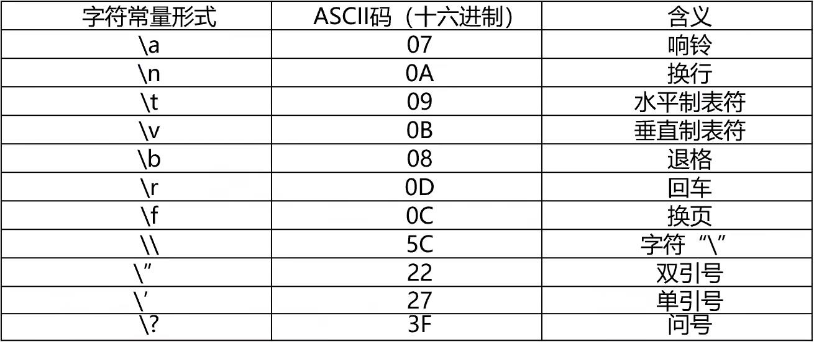
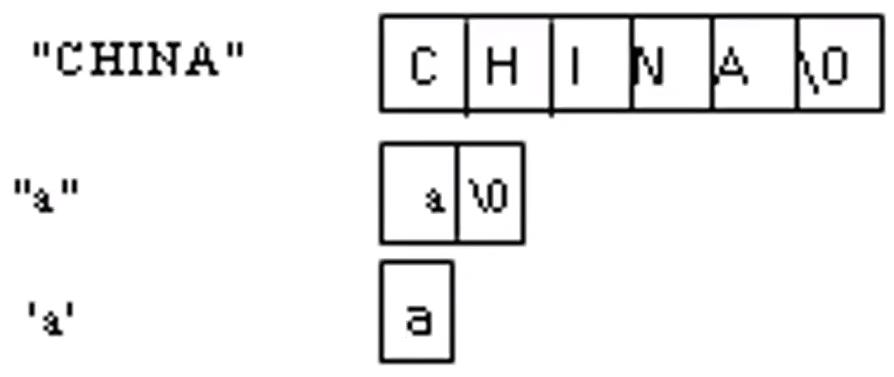
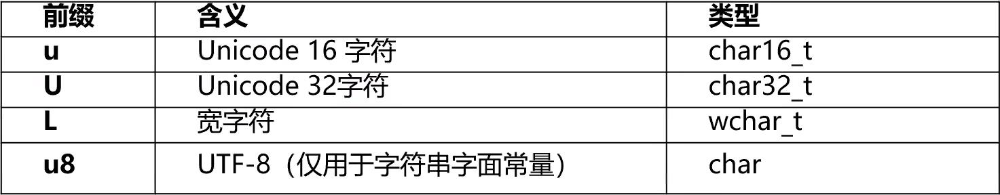
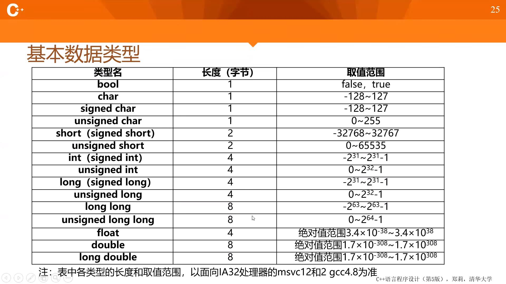
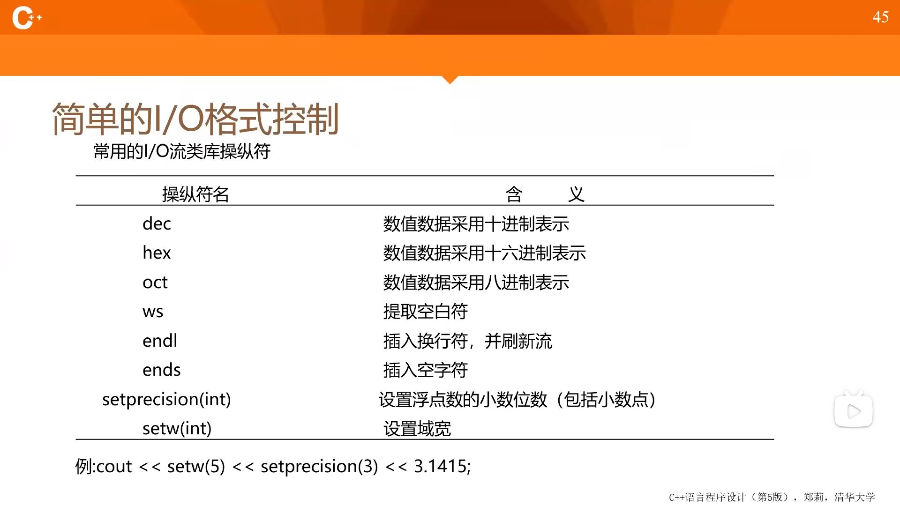

# C++简单程序设计
[TOC]
## C++语言的特点
- 兼容C
  - 它保持了C的简洁、高效和接近汇编语言等特点
  - 对C的类型系统进行了改革和扩充
  - C++也支持面向过程的程序设计，不是一个纯正的面向对象的语言
- 支持面向对象的方法
- 支持泛型程序设计方法
## 标准I/O流
### I/O流
- 在C++中，将数据从一个对象到另一个对象的流动抽象为“流”。流在使用前要被建立，使用后要被删除。
- 从流中获取数据的操作称为提取操作，向流中添加数据的操作称为插入操作。
- 数据的输入与输出是通过I/O流来实现的，cin和cout是预定义的流类对象。cin用来处理标准输入，即键盘输入。cout用来处理标准输出，即屏幕输出。
### 预定义的插入符和提取符
- "<<"是预定义的插入符，作用在流类对象cout上便可以实现向标准输出设备输出。
  - `cout` << 表达式 << 表达式...
- 标准输入是将提取符作用在流类对象cin上。
  - `cin` >> 表达式 >> 表达式...
- 提取符可以连续写多个，每个后面跟一个表达式，该表达式通常是用于存放输入值的变量。例如：
  - `int a， b;`
  - `cin >> a >> b;`
## 基本数据类型和表达式
### C++字符集
- 大小写的英文字母：`A~Z, a~z`
- 数字字符：`0~9`
- 特殊字符：
  `！ # % & * （ ） [ ] { } | \ ; : ' " ? < >`
### 词法记号
- 关键字： C++预定义的单词
- 标识符： 程序员声明的单词，它命名程序正文中的一些实体。（可能给数据起名字。给功能模块起名字，给自定义的数据类型取名字）
> 标识符的构成规则：
> - 以大写字母、小写字母或下划线（_）开始。
> - 可以由以大写字母、小写字母、下划线（_）或数字0~9组成。
> - 大写字母和小写字母代表不同的标识符。
> - 不是C++关键字或操作符。
- 文字： 在程序中直接使用符号表示的数据
- 操作符： 用于实现各种运算的符号
- 分隔符() {} , : ;  用于分隔各个词法记号或程序正文
- 空白符： 空格、制表符（TAB键产生的字符）、垂直制表符、换行符、回车符和注释的总称
### 基本数据类型
#### C++能够处理的基本数据类型
  - 整数类型
  - 浮点数类型
  - 字符类型
  - 布尔类型
#### 程序中的数据
##### 常量
  - 在源程序中直接写明的数据，其值在整个程序运行期间不可改变，这样的数据称为常量。
  > 文字常量是直接使用符号（文字）表示的值。例如：`12，3.5，'A'`都是常量。
##### 符号常量（由const修饰的对象）
  - 常量定义的语句的形式为：
    - `const`数据类型说明符 常量名=常量值；
    - 数据类型说明符 `const常量名=常量值；`
    - `constexpr`数据类型说明符 常量名=常量表达式； // `constexpr`修饰的对象暗含了`const`属性，并且必须由常量表达式初始化。
  - 例如， 我们可以定义一个代表圆周率的符号常量：
    - `const float PI = 3.1415926;`
    - `constexpr int size = get_size();` // 要求`get_size()`为常量表达式，即函数返回常量表达式。
  - 符号常量在定义时一定要初始化，而在程序中间不能改变其值。
  - 引入`constexpr`关键字要求编译器会验证初始值是否为常量表达式。
##### 常量表达式
- 常量表达式是一类==值不能发生改变==的表达式，其值在编译阶段确定，便于程序优化。文字常量是常量表达式，由常量表达式初始化的const对象也是常量表达式。一个对象或表达式是否为常量表达式取决于它的类型与初始值，例如：
- `const int max_size() = 100;` // max_size()是常量表达式
- `const int limit = max_size() + 1;` // limit是常量表达式
- `int student_size() = 30;` // student_size不是常量表达式
- `const int size = get_size();` // size不是常量表达式
##### 变量
  - 在程序运行过程中允许改变的数据，称为变量。
> 变量的定义：
> - 数据类型 变量名1， 变量名2， ...，变量名n；
> - 在定义一个变量的同时，也可以对它初始化。C++语言中提供了多种初始化方式，例如：
>   - `int a = 0;`
>   - `int a(0);`
>   - `int a = {0};`
>   - `int a{0};`
>   - 其中使用大括号的初始化方式称为列表初始化，列表初始化时不允许信息的丢失。例如用double值初始化int变量，就会造成数据丢失。
> - C++基本数据类型没有字符串类型，C++标准库中有`string`类。
##### 基本数据类型
###### 整数类型
  - 基本的整数类型
    - `int`
  - 按符号分
    - 符号的(`signed`)和无符号的(`unsigned`)
  - 按照数据的范围分
    - 短整数(`short`)和长整数(`long`)、长长整数(`long long`)
  - char类型
    - 字符型，实质上存储的也是整数(详见字符类型)
###### 整数文字常量
- 以文字形式出现的整数；
- 十进制
  - 若干个0~9的数字，但数字部分不能以0开头，正数前边的正号可以省略。
- 八进制
  - 前导0+若干个0~7的数字
- 十六进制
  - 前导0x+若干0~9的数字及A~F的字母(大小写均可)。
- 后缀
  - 后缀L(或I)表示类型至少是`long`，后缀LL(或II)表示类型是`long long`，后缀U(或u)表示`unsigned`类型。
###### 浮点数类型
- 单精度
  - `float`
- 双精度
  - `double`
- 扩展精度
  - `long double`
###### 浮点数文字常量
- 以文字形式出现的实数。
- 一般形式：
  - 例如，`12.5`， `-12.5`等
- 指数形式
  - 例如，`0.345E+2`, `-34.4E-3`
  - 整数部分和小数部分可以省略其一
- 浮点常量认为`double`型，如果后缀F(或f)可以使其称为`floa`t型，例如`12.3f`。
###### sizeof运算符
- 语法形式
  - `sizeof(类型名)`或`sizeof 表达式`
- 结果值
  - “类型名”所指定的类型，或“表达式”的结果类型所占的字节数。
- 例：
  - `sizeof(short)`
  - `sizeof x`
###### 字符类型
- `char`类型
- 容纳单个字符的编码
###### 字符串类型(详见第6章)
- C风格的字符串
  - 采用字符数组
- C++风格的字符串
  - 采用标准C++类库中的`string`类
###### 布尔类型
- bool类型，只有两个值：`true`(真)、`false`(假)
- 常用来表示关系比较、相等比较或逻辑运算的结果
###### 字符文字常量
- 单引号括起来的一个字符，如：`'a', 'D', '?', '$'`
- C++转义字符列表(用于在程序中表示不可显示字符)

###### C风格字符串常量
- 一对双引号括起来的字符序列
- 字符串与字符是不同的，它在内存中存放形式是：按串中字符的排列次序顺序存放，每个字符占一个字节，并在末尾添加'\0'作为结尾标记。

- 通过添加前缀可以改变字符常量或者字符串常量的类型，前缀及其含义如下表所示：
###### 基本数据类型大小
- 
- ISO C++标准并没有明确规定每种数据类型的字节数和取值范围，它只是规定它们之间的字节数大小顺序满足：
  - `(signed/unsigned)signed char <= (unsigned) short int <= (unsigned) int <= (unsigned) long int <= long long int`
###### 类型别名
- 可以为一个已有的数据类型另外命名
  - `typedef` 已有类型名 新类型名表
    - `typedef double Area, Volume;`
    - `typedef int Natural;`
    - `Natural i1, i2;`
    - `Area a;`
    - `Volume v;`
  - `using` 新类型名=已有类型名;
    - `using Area = double;`
    - `using Volume = double;`
###### auto类型与decltype类型（C++11）
- auto让编译器通过初始值自动推断变量的类型。
  - 例如： `auto val = val1 + val2;` val的类型取决于表达式val1+val2的类型，如果`val1+val2`是int类型，那么val将是int类型；如果`val1+val2`是`double`类型，那么val将是`double`类型。
- 定义一个变量与某一表达式的类型相同，但并不想用该表达式初始化这个变量，这时我们需要decltype变量
  - 例如：`decltype(i) j = 2;` 表示j以2作为初始值，类型与i一致。
### 算术运算符与算术表达式
- 基本算术运算符： `+ - * /(若整数相除，结果取整) %(取余，操作数为整数)`
- 优先级与结合性
  先乘除，后加减，同级自左至右
- `++， --`（自增、自减）
  例： `i ++; -- j`;
#### 赋值运算符和赋值表达式——简单的赋值运算符"="
- 举例：`n = n + 1`
- 表达式的类型：赋值运算符左边对象的类型
- 表达式的值：赋值运算符左边对象被赋值后的值
#### 逗号运算和逗号表达式
- 格式
  - 表达式1，表达式2
- 求解顺序及结果
  - 先求解表达式1，再求解表达式2
  - 最终结果为表达式2的值
- 例： `a = 3 * 5, a * 4` 最终结果为60
#### 关系运算与关系表达式
- 关系运算是比较简单的一种逻辑运算，优先次序为：
`< <= > >= == !=`
- 关系表达式是一种最简单的逻辑表达式
  其结果类型为bool，值只能为true或false
- 例如： `a > b, c <= a + b, x + y == 3`
#### 逻辑运算与逻辑表达式
- 逻辑运算符
  ！(非) &&(与) ||(或)
  > 优先级从高到低
- 逻辑表达式
  - 例如：`(a > b) && (x > y)` 其结果类型为bool，值只能为true或false
  - "&&"的"短路特性"
  表达式1 && 表达式2
    - 先求解表达式1
    - 若表达式1的值为false，则最终结果为false，不再求解表达式2
    - 若表达式1的结果为true，则求解表达式2，以表达式2的结果作为最终结果
  - "||"也具有类似的特性
#### 条件运算与条件表达式
- 一般形式
  表达式1 ？ 表达式2：表达式3
  表达式1必须是bool类型
- 执行顺序
  - 先求解表达式1，
  - 若表达式1的值为true，则求解表达式2，表达式2的值为最终结果
  - 若表达式1的值为false，则求解表达式3，表达式3的值为最终结果
  - 例：`x = a > b ? a : b;`
- 条件运算符的优先级
  - 条件运算符优先级高于赋值运算符，低于逻辑运算符
  - 表达式2、3的类型可以不同，条件表达式的最终类型为2和3中较高的类型。
  - 例：`x = a > b ? a : b;`
#### 位运算——按位与(&)
- 运算规则
  - 将两个运算量的每一个位进行逻辑与操作
  - 举例： 计算3 & 5
  3： 00000011
  5： 00000101
  *****************
  3&5： 0000001
- 用途：
  - 将某一位置0，其他位不变。例如：将`char`型变量`a`的最低位置0：`a = a & 0xfe;`
  - 取指定位。
    例如：有`char c; int a;`取出a的低字节，置于c中：`c = a & 0xff;`
#### 位运算——按位或(|)
- 运算规则
  - 将两个运算量的每一个位进行逻辑或操作
  - 举例： 计算3 | 5
  3： 00000011
  5： 00000101
  *****************
  3|5： 0000111
- 用途：
  - 将某一位置1，其他位不变。例如：将`int`型变量`a`的低字节置1：`a = a | 0xff;`
#### 位运算——按位异或(^)
- 运算规则
  - 两个操作数进行异或：
  若对应位相同，则结果该位为0，
  若对应位不同，则结果该位为1，
- 举例：计算071^052
  071: 00111001
  052: 00101010
  ***
  071^052: 00010011
- 用途：
  - 使特定位翻转(与0异或保持原值，与1异或取反)
  例如：要使01111010低四位翻转：
  01111010
  (^) 00001111
  ****
  01110101
#### 位运算——取反(~)
单目运算符，对一个二进制数按位取反
例： 025：:000000000010101
~025：1111111111101010
#### 位运算——移位
- 左移运算(<<)
  左移后，低位补0，高位舍弃
- 右移运算(>>)
  右移后，低位舍弃，高位：无符号数补0，有符号数补"符号位"
#### 混合运算时数据类型的转换
- 当把一个非布尔类型的算术赋值给布尔类型时，算术值为0则结果为false，否则结果为true。
- 当把一个布尔值赋值给非布尔类型时，布尔值为false则结果为0，布尔值为true则结果为1
- 当把一个浮点数赋值给整数类型时，结果值将只保留1浮点数中的整数部分，小数部分将丢失。
- 当把一个整数值赋值给浮点类型时，小数部分记为0。如果整数所占的空间超过了浮点类型的容量，精度可能有损失。
#### 混合运算时数据类型的转换——显式转换
- 语法形式(三种)：
  - 类型说明符(表达式)
  - (类型说明符)表达式
  - 类型转换操作符<类型说明符>(表达式)
    - 类型转换操作符可以是：`const_cast`、`dynamic_cast`、`reinterpret_cast`、`static_cast`
- 显式类型转换的作用是将表达式的结果类型转换为类型说明符所指定的类型。
- 例：`int(z), (int)z, static_cast<int>(z)`三种完全等价
#### 简单的I/O格式控制

## if语句
### if语句的语法形式
if(表达式)语句
  例： if(x > y) cout << x;
if(表达式)语句1 else 语句2
  例： if(x > y) cout << x;
if(表达式1)语句1
  else if(表达式2) 语句2
  else if(表达式3) 语句3
  ……
  else 语句n
### 嵌套的if结构
- 语法形式
  if( )
    if( )语句1
    else 语句2
  else
    if( )语句3
    else 语句4
- 注意
语句1、2、3、4可以是复合语句，每层的if与else配对，或用{}来确定层次关系。
## switch语句
### switch语句的语法
- 一般形式
  switch(表达式)
  {
    case 常量表达式1：语句1
    case 常量表达式2：语句2
    ……
    case 常量表达式n：语句n
    default: 语句n + 1
  }
- 执行顺序
  以case中的常量表达式值为入口标志，由此开始顺序执行。因此，每个case分支最后应该加break语句。
## while语句
### while语句语法
- 形式
  while(表达式)语句
  > 语句——可以是复合语句，其中必须含有改变循环控制条件的语句。
- 执行顺序
  先判断表达式的值，若为true时，执行语句。
## do-while语句
### do-while语句的语法形式
- 一般形式
  do 语句
  while(表达式)
- 执行顺序
  先执行循环体语句，后判断条件。表达式为true时，继续执行循环体
- 与while语句的比较
  while语句执行顺序：先判断表达式的值，为true时，再执行语句。
## for语句
- 语法形式
  for(初始语句；表达式1；表达式2) 语句
  for语句还有另一种更加简洁的写法，称为范围for语句，语法形式为：
  > for(声明： 表达式)
    语句

  这种形式的for语句主要用于遍历一个容器中的序列，将在第6、10章详细介绍
## 循环结构与选择结构的嵌套
例2_10：输入一系列整数，统计出正整数个数i和负整数个数j，读入0则结束。
- 分析：
  - 需要读入一系列整数，但是整数个数不定，要在每次读入之后进行判断，因此使用while循环最为合适。循环控制条件应该是n！= 0。由于要判断数的正负并分别进行统计，所以需要在循环内部嵌入选择结构。
## 其他流程控制语句
- break语句
  使程序从循环体和switch语句内跳出，继续执行逻辑上的下一条语句。不宜用在别处。
- continue语句
  结束本次循环，接着判断是否执行下一次循环。
- goto语句
  goto语句的作用是使程序的执行流程跳转到语句标号所指定的语句。
# 第2章小结
- 主要内容
  - 程序流程的选择和循环结构if、switch、while、do...while、for语句适用的场合、算法，几种流程控制语句的语法。
- 达到的目标
  - 能够设计简单的选择结构。循环结构算法，能够运用流程控制语句实现简单算法。