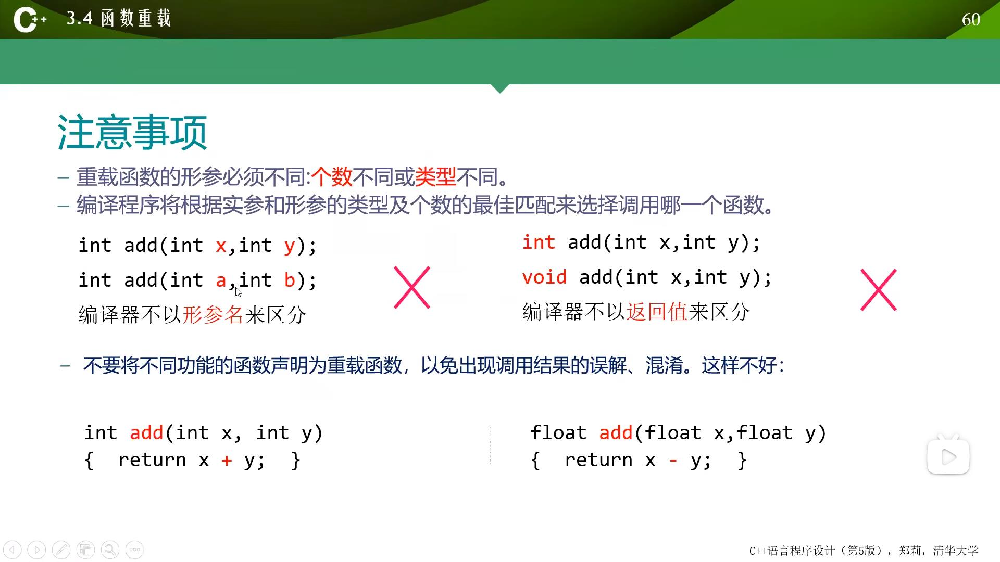

# 目录
- 本章主要内容
函数的定义与使用
内联函数
函数重载
使用C++系统函数
- 学习建议
- 用调试工具跟踪函数的调用与返回
- 分析递归函数的执行过程
- 完成本章习题与实验
[TOC]
## 函数定义与调用的语法
- 函数定义的语法形式
> 类型标识符 函数名(形式参数表)
{
    语句序列
}
### 函数的调用
- 调用前先声明函数：
  - 若函数定义在调用点之前，可以不另外声明；
  - 若函数定义在调用之后，必须要在调用函数前声明
  > 函数原型： 类型标识符 被调用函数名（含类型说明的形参表）；
- 调用形式
  函数名（实参列表）
- 嵌套调用
  在一个函数的函数体中，调用另一函数。
- 递归调用
  函数直接或间接调用自身。
## 利用函数进行功能分解
### 例：3_6投骰子游戏
- `rand`
  函数原型： `int rand(void);`
  所需头文件：<`cstdlib`>
  功能和返回值：求出并返回一个伪随机数
- `srand`
  函数原型：`void srand(unsigned int seed);`
  参数：seed产生随机数的种子。
  所需头文件：<`cstdlib`>
  功能：为使`rand()`产生一序列伪随机整数而设置起始点。使用1作为`seed`参数，可以重新初始化`rand()`
## 函数的嵌套调用与递归调用
- 嵌套调用
  - 在一个函数的函数体中，调用另-一函数
- 递归调用
  - 函数直接或间接调用自身
## 函数的参数
### 函数的参数传递
- 在函数被调用时才分配形参的存储单元
- 实参可以是常量、变量或表达式
- 实参类型必须与形参相符或可隐式转换为形参类型
- 引用传递可以实现双向传递
- >3_12交换整数（引用传递）
- 常引用作参数可以保障实参数据的安全
### 引用类型
- 引用(&)是标识符的别名，例如：
  ```c++
  int i, j;
  int &ri = i; // 定义int引用ri, 并初始化为变量i的作用
  j = 10;
  ri = j; // 相当于i = j;
  ```
- 声明一个引用时，必须同时对它进行初始化，使它指向一个已存在的对象。
- 一旦一个引用被初始化后，就不能改为指向其它对象。
- 引用可以作为形参
  ```c++
  void swap(int &a, int &b){...}
  ````
  ### 可变数量形参
  - 使用模板类initializer_list<T>（模板将于第九章介绍）可向函数传递同类不定个数参数，例如：
  ```c++
  void log_info(initializer_list<string> lst)
  {
    for(auto &info: lst)
        cout << info << ' ';
    cout << endl;
  }
  log_info({"Hello", "world", "!"});
  ```
  - `initializer_list<string> lst` 接受不定个数字符串实参
  - 注意，实参以大括号列表方式给出
  - 使用范围`for`语句遍历`lst`，`auto`自动推断元素为`string`类型
### 参数的默认值
- 可以预先设置默认的参数值，调用时如给出实参，则采用实参值，否则采用预先设置的默认参数值。
- 例如：
  ```c++
  int add(int x = 5, int y = 6)
  {
    return x + y;
  }
  int main()
  {
    add(10, 20); // 10 + 20
    add(10); // 10 + 6
    add(); // 5 + 6
  }
  ```
 ### 默认参数值的说明次序
 - 有默认参数的形参必须列在形参列表的最右，即默认参数值的右面不能有无默认值的参数
 - 调用时实参与形参的结合次序是从左向右
 - 例：
  ```c++
  int add(int x, int y = 5, int z = 6); // 正确
  int add(int x = 1, int y = 5, int z); // 错误
  int add(int x = 1, int y, int z = 6); // 错误
  ```
 ### 默认参数值与函数的调用位置
 - 如果一个函数有原型声明，且原型声明在定义之前，则默认参数值必须在函数原型声明中给出；而如果只有函数的定义，或函数定义在前，则默认参数值需在函数定义中给出。
 - 例：
  ```c++
  int add(int x = 5, int y = 6);
  // 原型声明在前
  int main(){
    add();
  }
  int add(itn x, int y){
    // 此处不能再指定默认值
    return x + y;
  }
  ```
  ```c++
  int add(int x = 5, int y = 6){
    // 只有定义，没有原型声明
    return x + y;
  }
  int main(){
    add();
  }
  ```
## 函数的内联、重载，系统函数的调用
### 内联函数
- 声明时使用关键字`inline`。
- 编译时在调用处用函数体进行替换，节省了参数传递、控制转移等开销。
- 注意：
  - 内联函数体内不能有`循环语句`和`switch`语句；
  - 内联函数的定义必须出现在内联函数第一次被调用之前；
  - 对内联函数不能进行异常接口声明。
### 函数重载
- C++允许功能相近的函数在相同的作用域内以相同函数名声明，从而形成重载。方便使用，便于记忆。
- 例：
  形参类型不同
  ```c++
  int add(int x, int y);
  float add(float x, float y);
  ```
  形参个数不同
  ```c++
  int add(int x, int y);
  int add(int x, int y, int z);
  ```
  
### 使用C++系统函数
- C++的系统库中1提供了几百个函数可供程序员使用，例如：
  - 求平方根函数(`sqrt`)
  - 求绝对值函数(`abs`)
- 使用系统函数时要包含相应的头文件，例如：
  - `cmath`
## 小结
- 主要内容
  - 函数的声明和调用、函数间的参数传递、内联函数、带默认参数值的函数、函数重载、C++系统函数
- 达到的目标
  - 学会将一段功能相对独立的程序写成一个函数，为下一章学习类和对象打好必要的基础。