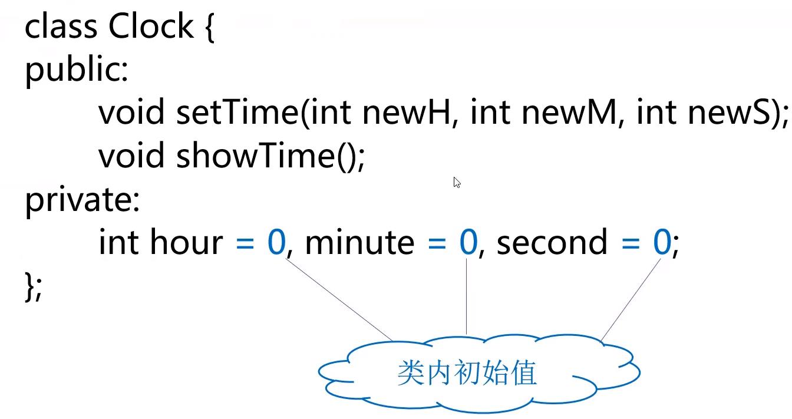

[TOC]
# 面向对象程序设计的基本特点
抽象与封装
## 类与对象的基础概念和语法
### 抽象
- 对同一类对象的共同属性和行为进行概括，形成类。
  - 先注意问题的本质，其次是实现过程或细节。
  - 数据抽象：描述1某类对象的属性或状态（对象相互区别的物理量）。
  - 代码抽象：描述某类对象的共有的行为特征或具有的功能。
  - 抽象的实现：类。
### 封装
- 将抽象出的数据、代码封装在一起，形成类。
  - 目的：增强安全性和简化编程，使用者不必了解具体的实现细节，而只需要通过外部接口，以特定的访问权限，来使用类的成员。
  - 实现封装：类声明中的{}
# 类和对象
## 类与对象的关系
- 对象是现实中的对象在程序中的模拟。
- 类是同一类对象的抽象，对象是类的某一特定实体。
- 定义类的对象，才可以通过对象使用类中定义的功能。
## 类定义的语法形式
```c++
class 类名称
{
    public: 公有成员（外部接口）
    private: 私有成员
    protected: 保护型成员
}
```
## 类成员的访问控制
- 公有类型成员
  - 在关键字public后面声明，它们是类与外部的接口，任何外部函数都可以访问公有类型数据和函数。
- 私有类型成员
  - 在关键字`private`后面声明，只允许本类中的函数访问，而类外部的任何函数都不能访问。
  - 如果紧跟在类名称的后面声明私有成员，则关键字`private`可以省略。
- 保护类型成员
  - 与`private`类似，其差别表现在继承与派生时对派生类的影响不同，详见第七章。
## 对象定义的语法
类名 对象名；
```c++
例： Clock myClock;
```
### 类中成员相互访问
直接使用成员名访问
### 类外访问
使用"对象名.成员名"方式访问`public`属性的成员
举例：4_1-1钟表类：
```c++
#include<iostream> 

using namespace std;

class Clock{ // 时钟类的定义
	public: // 外部接口，公有成员函数
		void setTime(int newH = 0, int newM = 0, int newS = 0);
		void showTime();
	private: // 私有数据成员
		int hour, minute, second;
};

// 时钟类成员函数的具体实现
void Clock::setTime(int newH, int newM, int newS) {
	hour = newH;
	minute = newM;
	second = newS;
}

void Clock::showTime(){
	cout << hour << ":" << minute << ":" << second << endl;
}

// 对象的使用
int main()
{
	Clock myClock; // 定义对象myClock
	myClock.setTime(8, 30, 30);
	myClock.showTime();
	return 0;
 } 
```
### 类内初始值
- 可以为数据成员提供一个类内初始值
- 在创建对象时，类内初始值用于初始化数据成员
- 没有初始值的成员将被默认初始化。

## 类的成员函数
- 在类中说明函数原型；
- 可以在类外给出函数体实现，并在函数名前使用类名加以限定；
- 也可以直接在类中给出函数体，形成内联成员函数；
- 允许声明重载函数和带默认参数值的函数。
## 内联成员函数
- 为了提高运行时的效率，对于简单的函数可以声明为内联形式。
- 内联函数体中不要有复杂结构（如循环语句和switch语句）。
- 在类中声明内联成员函数的方式：
  - 将函数体放在类的声明中。
  - 使用`inline`关键字。
# 构造函数和析构函数
## 构造函数
- 定义对象时，如何进行初始化呢？对象的初始化方法需要在程序中规定好，为此，C++语法提供了一个特殊的机制——构造函数。
### 构造函数的作用
- 在对象被创建时使用特定的值构造对象，将对象初始化为一个特定的初始状态。
- 例如：
  - 希望在构造一个Clock类对象时，将初始时间设为0：0：0，就可以通过构造函数来设置。
### 构造函数的形式
- 函数名与类名相同；
- 不能定义返回值类型，也不能有`return`语句；
- 可以有形式参数，也可以没有形式参数；
- 可以是内联函数；
- 可以重载；
- 可以带默认参数值。
### 构造函数的调用时机
- 在对象创建时被自动调用
- 例如：
  ```c++
  Clock myClock(0, 0, 0);
  ```
### 隐含生成的构造函数
- 如果程序中未定义构造函数，编译器将在需要时自动生成一个默认构造函数
  - 参数列表为空，不为数据成员设置初始值；
  - 如果类内定义了成员额初始值，则使用类内定义的初始值；
  - 如果没有定义类内的初始值，则以默认方式初始化；
  - 基本类型的数据默认初始化的值是不确定的。
#### 默认构造函数
- 调用时可以不需要实参的构造函数
  - 参数表为空的构造函数
  - 全部参数都有默认值的构造函数
- 下面两个都是默认构造函数，如在类中同时出现，将产生编译错误：
  ```c++
  Clock();
  Clock(int newH = 0, int newM = 0, int newS = 0);
  ```
构造函数
```c++
// 类定义
class Clock{
    public:
        Clock(int newH, int newM, int newS); // 构造函数
        Clock(); // 默认构造函数
        void setTime(int newH, int newM, int newS);
        void showTime();
    private:
        int hours, minute, second;
};

// 构造函数的实现
Clock::Clock(int newH, int newM, int newS): hour(newH), minute(newM), second(newS){
}
Clock::Clock(): hour(0), minute(0), second(0){
}
// 其他函数实现同例4_1-1

int main(){
    CLock c1(0, 0, 0); // 调用有参数构造函数
    CLock c2(); // 调用无参数构造函数
    c1.showTime();
    c2.showTime();
    return 0;
}
```
### "=default"
- 如果类中已定义构造函数，默认情况下编译器就不再隐含生成默认构造函数。`如果此时依然希望编译器隐含生成默认构造函数，可以使用"=default"`
- 例如：
  ```c++
  class Clock{
    public:
        Clock() = default; // 指示编译器提供默认构造函数
        Clock(int newH, int newM, int newS); // 构造函数
    private:
        int hour, minute, second;
  };
  ```
### 委托构造函数
  - 类中往往有多个构造函数，只是参数表和初始化列表不同，其初始化算法都是相同的，这时，为了避免代码重复，可以使用委托构造函数。
  - 委托构造函数使用类的其他构造函数执行初始化过程
  - 例如：
  ```c++
  Clock::Clock(int newH, int newM, int newS): hour(newH), minute(newM), second(newS){}
  Clock::Clock():Clock(0, 0, 0){}
  ```
### 复制构造函数
 - 我们经常会需要用一个已经存在的对象，去初始化新的对象，这时就需要一个特殊的构造函数——复制构造函数；
 - 隐含生成的复制构造函数可以实现对应数据成员——复制；
 - 自定义的复制构造函数可以实现特殊的复制功能。
 #### 复制构造函数定义
 复制构造函数是一种特殊的构造函数，其形参为本类的对象引用。作用是用一个已存在的对象去初始化同类型的新对象。
 ```c++
 class 类名{
    public:
        类名（形参）； // 构造函数
        类名（const 类名 &对象名）； // 复制构造函数
        // ……
 };
 类名：：类（const 类名 &对象名） // 复制构造函数的实现
 { 函数体 }
 ```
### "=delete"
 - 如果不希望对象被复制构造
   - C++98做法：将复制构造函数声明为`private`，并且不提供函数的实现。
   - C++11做法：用"=delete"指示编译器不生成默认复制构造函数。
     - 例：
        ```c++
        class Point{ // Point类的定义
            public:
                Point(int xx = 0, int yy = 0{x = xx, y = yy;}) // 构造函数，内联
                Point(const Point& p) = delete; // 指示编译器不生成默认复制构造函数
            private:
                int x, y; // 私有数据
        };
        ```
 ### 复制构造函数被调用的三种情况
 - 定义一个对象时，以本类另一个对象作为初始值，发生复制构造；
 - 如果函数的形参是类的对象，调用函数时，将使用实参对象初始化形参对象，发生复制构造；
 - 如果函数的返回值是类的对象，函数执行完成返回主调函数时，将使用`return`语句中的对象初始化一个临时无名对象，传递给主调函数，此时发生复制构造。
   - 这种情况如何避免不必要的复制？
  ```c++
  class Point{ // Point类
    public:
        Point(int xx = 0, int yy = 0){x = xx; y = yy;} // 构造函数，内联
        Point(const Point& p); // 复制构造函数
        void setX(int xx){x = xx};
        void setY(int yy){y = yy};
        int getX() const {return x;} // 常函数(第五章)
        int getY() const {return y;} // 常函数(第五章)
    private:
        int x, y; // 私有数据
  };

  // 复制构造函数的实现
  Point::Point(const Point& p){
    x = p.x;
    y = p.y;
    cout << "Calling the copy constructor" << endl;
  }

  // 形参为Point类对象
  void fun1(Point p){
    cout << p.getX() << endl;
  }

  // 返回值为Point类对象
  Point fun2{
    Point a(1, 2);
    return a;
  }

  int main(){
    Point a(4, 5);
    Point b(a); // 用a初始化b。
    cout << b.getX() << endl;
    fun1(b); // 对象b作为fun1的实参
    b = fun2(); // 函数的返回值是类对象
    cout << b.getX() << endl;
    return 0;
  }
  ```
### 左值与右值
- 简单理解：左值是位于复制运算左侧的对象或变量，右值是位于赋值运算右侧的值。
#### 右值引用
- 对持久存在变量的引用称为左值引用，用&表示（即第三章引用类型）
- 对短暂存在可被移动的右值的引用称之为右值引用，用&&表示
  ```c++
  float n = 6;
  float &lr_n = n; // 左值引用
  float &&rr_n = n; // 错误，右值引用不能绑定到左值
  float &&rr_n = n * n; // 右值表达式绑定到右值引用
  ```
- 通过标准库`<utility>`中的`move`函数可将左值对象移动为右值
  ```c++
  float n = 10;
  float &&rr_n = std::move(n); // 将n转化为右值
  使用move函数承诺除对n重新赋值或1销毁外，不以rr_n以外方式使用
  ```
  ### 移动构造函数
  基于右值引用，移动构造函数通过移动数据方式构造新对象，与复制构造函数类似，移动构造函数参数为该类对象的右值引用。示例如下
  ```c++
  #include<utility>
  class astring{
    public:
        std::string s;
        astring(astring&& o) noexcept: s(std::move(o.s)) // 显示移动所有成员
        {函数体}
  }
  ```
  - 移动构造函数不分配新内存，理论上不会报错，为配合异常捕获机制，需声明noexcept表明不会抛出异常（将于12章异常处理介绍）
  - 被移动的对象不应再使用，需要销毁或重新赋值
## 析构函数
- 完成对象被删除前的一些清理工作。
- 在对象的生存期结束的时刻系统自动调用它，然后再释放此对象所属空间。
- 如果程序中未声明析构函数，编译器将自动产生一个默认的析构函数，其函数体为空。
```c++
#include<iostream>
using namespace std;
class Point{
    public:
        Point(int xx, int yy);
        ~Point();
        // ...其他函数原型
    private:
        int x, y;
};
Point::Point(int xx, int yy)
{
    x = xx;
    y = yy;
}
Point::~Point{
}
// ...其他函数的实现略
```
# 内联成员函数
# 类的组合
C++语言支持部件组装的思想，就是类组合的机制：在定义一个新类时，可以用已有类的对象作为成员。
## 组合的概念
- 类中的成员是另一个类的对象。
- 可以在已有抽象的基础上实现更复杂的抽象。
## 类组合的构造函数设计
- 原则：不仅要负责对本类中的基本类型成员数据初始化，也要对对象成员初始化。
- 声明形式：
  ```
  类名：：类名（对象成员所需的形参，本类成员形参
    ：对象1（参数）， 对象2（参数）， ……
    {
        // 函数体其他语句
    }
  ```
## 构造组合类对象时的初始化次序
- 首先对构造函数初始化列表中列出来的成员（包括基本类型成员和对象成员）进行初始化，初始化次序是成员在类体中定义的次序。
  - 成员对象构造函数调用顺序：按对象成员的声明顺序，先声明者先构造。
  - 初始化列表中未出现的成员对象，调用用默认构造函数（即无形参的）初始化
- 处理完初始化列表之后，再执行构造函数的函数体。
例4_4:类的组合，线段（Line）类
```c++
#include<iostream>
#include<cmath>
using namespace std;
class Point{
    public:
        Point(int xx = 0, int yy = 0){ // Point类定义
            x = xx;
            y = yy;
        }
        Point(Point& p);
        int getX(){return x;}
        int getY(){return y;}
    private:
        int x, y;
};

Point::Point(Point &p){ // 复制构造函数的实现
    x = p.x;
    y = p.y;
    cout << "Calling the copy constructor of Point" << endl;
}

// 类的组合
class Line{  // Line类的定义
    public: // 外部接口
        Line(Point xp1, Point xp2);
        Line(Line &l);
        double getLen(){ return len; }
    private: // 私有数据成员
        Point p1, p2; // Point类的对象p1, p2
        double len;
};

// 组合类的构造函数
Line::Line(Point xp1, Point xp2) : p1(xp1), p2(xp2){
    cout << "Calling constructor of Line" << endl;
    double x = static_cast<double>(p1.getX() - p2.getX());
    double y = static_cast<double>(p1.getY() - p2.getY());
    len = sqrt(x * x + y * y);
}
Line::Line(Line &l): p1(l.p1), p2(l.p2){ // 组合类的复制构造函数
    cout << "Calling the copy constructor of Line" << endl;
    len = l.len;
}
```
# 前向引用声明
- 类应该先声明，后使用
- 如果需要在某个类的声明之前，引用该类，则应进行前向引用声明。
- 前向引用声明只为程序引入一个标识符，但具体声明在其他地方。
举例：
```c++
class B; // 前向引用声明
class A{
    void f(B b);
};
class B{
    public:
        void g(A a);
};
```
```c++
class Fred; // 前向引用声明
class Barney{
    Fred x; // 错误：类Fred的声明尚不完善
}；
class Fred{
    Barney y;
};
```
## 前向引用声明注意事项
- 使用前向引用声明虽然可以解决一些问题，但它并不是万能的。
- 在提供一个完整的类声明之前，不能声明该类的对象，也不能再内联成员函数中使用该类的对象。
- 当使用前向引用声明时，只能使用被声明的符号，而不能涉及类的任何细节。
# 枚举类