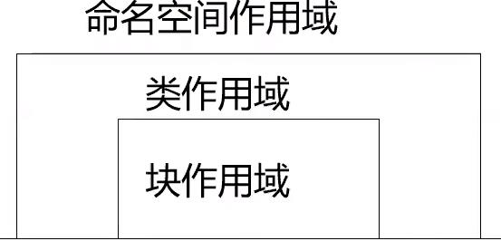

[TOC]
# 函数间的数据共享
不同位置定义的变量和对象，其作用域、可见性、生存期都不同。
程序模需要协作共同完成整个系统的功能，模块间需要共享数据，就需要知道应该将变量和对象定义在什么位置。
## 作用域
- 作用域是一个标识符在程序正文中有效地区域。
- 作用域分类
  - 函数原型作用域
  - 局部作用域（块作用域）
  - 类作用域
  - 命名空间作用域
  - 限定作用域的枚举类
### 函数原型作用域
- 函数原型中的参数，其作用域始于"("，结束与")"。
- 例：`double area(double radius);` // radius的作用域仅在于此，不能用于程序正文其他地方。
### 局部作用域
- 函数的形参、在块中声明的标识符；
- 其作用域自声明处起，限于块中。
- 例：
  ```c++
  void fun(int a){ // a的作用域
    int b = a; // b的作用域
    cin >> b;
    if(b > 0)
    {
        int c; // c的作用域
        ……
    }
  }
  ```
### 类作用域
- 类的成员具有类作用域，其范围包括类体和非内联成员函数的函数体。
- 如果在类作用域以外访问类的成员，要通过类名（访问静态成员），或者该类的对象名、对象引用、对象指针（访问非静态成员）。

### 命名空间作用域
- 命名空间可以解决类名。函数名等的命名冲突
- 命名空间的声明
  ```
  namespace 命名空间名{
    各种声明（函数声明、类声明、......)
  }
  ```
- 例：
  ```c++
  namespace SomeNs{
    class SomeClass {...};
  }
  ```
  引用类名：SomeNs::SomeClass obj1;
- `using`语句有两种形式
  - `using 命名空间::标识符名；`
  - `using namespace 命名空间名；`
- 特殊的命名空间
  - 全局命名空间：默认的命名空间
  - 匿名命名空间：对每一个源文件是唯一的
### 限定空间的枚举类
```c++
enum color {red, yellow, green}; // 不限定作用域
enum color2 {red, yellow, green}; // 错误，重复定义
enum class color2 {red, yellow, green}; // 正确，限定作用域
color c = red; // 全局作用域color枚举类
color2 c2 = red; // 错误，color2元素不在有效作用域内
color2 c2 = color2::red; // 正确，使用了color2作用域枚举元素
```
## 可见性
- 可见性是从对标识符的引用的角度来谈的概念
- 可见性表示从内层作用域向外层作用域“看”时能看见什么。
- 如果标识在某处可见，就可以在该处引用此标识符。
- 如果某个标识符在外层中声明，且在内层中没有同一标识符的声明，则该标识符在内层可见。
- 对于两个嵌套的作用域，如果在内层作用域内声明了与外层作用域中同名的标识符，则外层作用域的标识符在内层不可见。
  
例：5_1
    ```c++
    #include<iostream> 

    using namespace std;

    int i;	// 全局变量，文件作用域 
    int main(){
        i = 5;	// 为全局变量i赋值 
        {
            int i;	// 局部变量，局部作用域 
            i = 7;
            cout << "i = " << i << endl; // 输出7 
        }
        cout << "i = " << i << endl; // 输出5 
        return 0;
    }
    ```
## 对象的生存期
对象从产生到结束的这段时间就是它的生存期。在对象生存期内，对象将保持它的值，直到被更新为止。
### 静态生存期
- 这种生存期与程序的运行期相同。
- 在文件作用域中声明的对象具有这种生存期。
- 在函数内部声明静态生存期对象，要冠以关键字`static`。
### 动态生存期
- 块作用域中声明的，没有用`static`修饰的对象是动态生存期的对象（习惯称局部生存期对象）。
- 开始于程序执行到声明点时，结束与命名该标识符的作用域结束处。

# 对象间的共享
同类对象数据共享：静态数据成员
同类对象功能共享：静态函数成员
类与外部数据共享：友元
## 静态数据成员
-  用关键字`static`声明
-  为该类的所有对象共享，静态数据成员具有静态生存期
-  一般在类外初始化，用（：：）来指明所属的类
-  C++11支持静态变量（`const`或`constexpr`修饰）类内初始化，此时类外仍可定义该静态成员，但不可再次初始化操作

例：5_4静态数据成员
```c++
#include<iostream>
using namespace std;
class Point{ // Point类定义1
	public: // 外部接口
		Point(int x = 0, int y = 0) :x(x), y(y){ // 构造函数 
			// 在构造函数中对count累加，所有对象共同维护同一个count 
			count ++; 
		}
		Point(Point& p){ // 复制构造函数 
			x = p.x;
			y = p.y;
			count ++;
		}
		~Point(){ count --; } // 析构函数，点对象生存期结束时count--；
		int getX(){return x;}
		int getY(){ return y;}
		
		void showCount(){ // 输出静态数据成员 
			cout << " Object count = " << count << endl;
		} 
	private: // 私有数据成员
		int x, y;
		static int count; // 静态数据成员声明，用于记录点的个数 
};
int Point::count = 0; // 静态数据成定义和初始化，使用类名限定
int main(){
	Point a(4, 5); // 定义对象a，其构造函数会使count增1
	cout << "Point A: "  << a.getX() << ", " << a.getY();
	a.showCount(); // 输出对象个数
	
	Point b(a); // 定义对象b,其构造函数会使count增1
	cout << "Point B:"  << b.getX() << ", " << b.getY();
	b.showCount(); // 输出对象个数
	return 0; 
} 
```

## 静态函数成员
- 类外代码可以使用类名和作用域操作符来调用静态成员函数。
- 静态成员函数主要用于处理该类的静态数据成员，可以直接调用静态成员函数。
- 如果访问非静态成员，要通过对象来访问。

例：5_5静态函数成员
```c++
#include<iostream>
using namespace std;
class Point{ // Point类定义1
	public: // 外部接口
		Point(int x = 0, int y = 0) :x(x), y(y){ // 构造函数  
			count ++; 
		}
		Point(Point& p){ // 复制构造函数 
			x = p.x;
			y = p.y;
			count ++;
		}
		~Point(){ count --; } // 析构函数，点对象生存期结束时count--；
		int getX(){return x;}
		int getY(){ return y;}
		
		static void showCount(){ // 输出静态数据成员 
			cout << " Object count = " << count << endl;
		} 
	private: // 私有数据成员
		int x, y;
		static int count; // 静态数据成员声明，用于记录点的个数 
};
int Point::count = 0; // 静态数据成定义和初始化，使用类名限定
int main(){
	Point::showCount(); // 输出对象个数 
	Point a(4, 5); // 定义对象a，其构造函数会使count增1
	cout << "Point A: "  << a.getX() << ", " << a.getY();
	a.showCount(); // 输出对象个数
	
	Point b(a); // 定义对象b,其构造函数会使count增1
	cout << "Point B:"  << b.getX() << ", " << b.getY();
	Point::showCount(); // 输出对象个数
	return 0; 
} 
```
## 类的友元
单向的授权
- 友元是C++提供的一种破坏数据封装和数据隐藏的机制。
- 通过将一个模块声明为另一个模块的友元，一个模块能够引用到另一个模块中本是被隐藏的信息。
- 可以使用友元函数和友元类。
- 为了确定数据的完整性，及数据封装与隐藏的原则，建议尽量不使用或少使用友元。
### 友元函数
- 友元函数是在类声明中由关键字`friend`修饰说明的非成员函数，在它的函数体中能够通过对象名访问`private`和`protected`成员
- 作用：增加灵活性，使程序员可以在封装和快速性方面做合理选择。
- 访问对象中的成员必须通过对象名。
  
例：5_6使用友元函数计算两点间的距离
```c++
#include<iostream>
#include<cmath>
using namespace std;
 
class Point{
	public:
		Point(int x = 0, int y = 0):x(x), y(y){}
		int getX(){ return x; }
		int getY(){ return y;}
		friend float dist(Point &a, Point &b);
	private:
		int x, y;
};

float dist(Point& a, Point& b){
	double x = a.x - b.x;
	double y = a.y - b.y;
	return static_cast<float>(sqrt(x * x + y * y));
}

int main()
{
	Point p1(1, 1), p2(4, 5);
	cout << "The distance is: ";
	cout << dist(p1, p2) << endl;
	return 0;
}
```
### 友元类
- 若一个类为另一个类的友元，则此类的所有成员都能访问对方类的私有成员。
- 声明语法：将友元类名在另一个类中使用`friend`修饰说明。

友元类举例
```c++
class A{
	friend class B;
	public:
		void display(){
			cout << x << endl;
		}
	private:
		int x;
}

class B{
	public:
		void set(int i);
		void display();
	private:
		A a;
};

void B::set(int i){
	a.x = i;
}
void B::display(){
	a.display();
}
```
### 类的友元关系是单向的
如果声明B类是A类的友元，B类的成员函数就可以访问A类的私有和保护数据，但A类的成员函数却不能访问B类的私有、保护数据。

# 共享数据的保护
对于既需要共享、又需要防止改变的数据应该声明为`常类型`（用`const`进行修饰）。
对于不改变对象状态的成员函数应该声明为常函数。
## 常类型
- 常对象：必须进行初始化，不能被更新。
  `const 类名 对象名`
- 常成员
  用`const`进行修饰的类成员：常数据成员和常函数成员
- 常引用：被引用的对象不能被更新。
  `const 类型说明符 &引用名`
- 常数组：数组元素不能被更新（详见第6章）。
  `类型说明符 const 数组名[大小]...`
- 常指针：指向常量的指针（详见第6章）。
### 常对象
- 用`const`修饰的对象
- 例：
  ```c++
  class A
  {
	public:
		A(int i, int j){x = i; y = j;}
	private:
		int x, y;
  };
  A const a(3, 4);
  ```
- 思考：哪些操作有试图改变对象状态的危险？
### 常成员
- 用`const`修饰的对象成员
- 常成员函数
  - 使用`const`关键字说明的函数。
  - 常成员函数不更新对象的数据成员。
  - 常成员函数说明格式：
	`类型说明符 函数名（参数表） const;`
	这里，`const`是函数类型的一个组成部分，因此在实现部分也要带`const`关键字。
  - `const`关键字可以被用于参与对重载函数的区分。
- 通过常对象只能调用它的常成员函数。
- 常数据成员
  - 使用`const`说明的数据成员。

例：5_7常成员函数
```c++
#include<iostream>
using namespace std;
class R{
	public:
		R(int r1, int r2): r1(r1), r2(r2){}
		// void print();
		void print() const;
	private:
		int r1, r2;
};

// void R::print(){
// 	cout << r1 << ":" << r2 << endl;
// }
void R::print() const{
	cout << r1 << ";" << r2 << endl;
}

int main(){
	R a(5, 4);
	a.print(); // 调用void print()
	const R b(20, 52);
	b.print(); // 调用void print() const
	return 0;
}
```
例：5_8常数据成员
```c++
#include<iostream>
using namespace std;
class A{
	public:
		A(int i);
		void print();
	private:
		const int a;
		static const int b; // 静态常数据成员
};
const int A::b = 10;
A::A(int i): a(i){} // 常数据成员只能通过初始化列表来获得初值
void A::print(){
	cout << a << ":" << b << endl;
}
int main(){
	// 建立对象a和b，并以100和0作为初值，分别调用构造函数，
	//通过构造函数的初始化列表给对象的常数据成员初始化
	A a1(100), a2(0);
	a1.print();
	a2.print();
	return 0;
}
```

### 常引用
- 如果在声明引用时用`const`修饰，被声明的引用就是常引用。
- 常应用所引用的对象不能被更新。
- 如果用常引用作形参，便不会意外地发生对实参的更改。常引用的声明形式如下
  - `const 类型说明符 &引用名;`

例：5_9常引用作形参
```c++
#include<iostream>
#include<cmath>
using namespace std;
class Point{
	public:
		Point(int x = 0, int y = 0):x(x), y(y){}
		int getX(){ return x;}
		int getY(){ return y;}
		friend float dist(const Point &p1, const Point &p2);
	private:
		int x, y;
};

float dist(const Point &p1, const Point &p2){
	double x = p1.x - p2.x;
	double y = p1.y - p2.y;
	return  static_cast<float>(sqrt(x * x + y * y));
}

int main(){
	const Point myp1(1, 1), myp2(4, 5);
	cout << "The distance is: ";
	cout << dist(myp1, myp2) << endll;
	return 0;
}
```
# 小节
- 主要内容
  - 作用域与可见性、对象的生存期、数据的共享与保护、友元、编译预处理命令、多文件结构和工程
- 达到的目标
  - 理解并能够运用作用域与可见性、对象的生存期
  - 掌握函数之间、类之间、对象之间数据的共享与保护方法。
  - 掌握编译预处理命令，学会用多文件结构部和工程