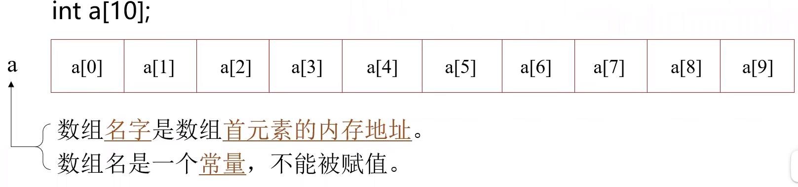

[TOC]
# 数组
- 数组是具有一定顺序关系的若干相同类型变量的集合体，组成数组的变量称为该数组的元素。
## 数组的定义
`类型说明符 数组名[常量表达式][常量表达式]……;`
> 数组名的构成方法与一般变量名相同。

例如：`int a[10];`表示a为整型数组，有10个元素：a[0]...a[9]
例如：`int a[5][3];`表示a为整型二维数组，其中第一维有5个下标(0~4)，第二维有3个下标(0~2)，数组的元素个数为15，可以用于存放5行3列的整型数据表格。
## 数组的使用
- 使用数组元素
  - 数组必须先定义，后使用
  - 可以逐个引用数组元素
  - 例如：
    ```c++
    a[0] = a[5] + a[7] - a[2 * 3];
    b[1][2] = a[2][3] / 2;
    ```
例6_1:
```c++
#include<iostream>
using namespace std;

int main()
{
	int a[10], b[10];
	for(int i = 0; i < 10; i ++)
	{
		a[i] = i * 2 - 1;
		b[10 - i - 1] = a[i];
	}
	
	for(const auto &e: a) // 范围for循环，输出a中每个元素
		cout << e << " " ;
	cout << endl;
	
	for(int i = 0; i < 10; i ++) // 下标迭代循环，输出b中每个元素
		cout << b[i] << " ";
	cout << endl;
	
	return 0;
}
```
## 一维数组的存储与初始化
### 一维数组的存储
数组元素在内存中顺序存放，它们的地址是连续的。元素间物理地址上的相邻，对应在逻辑次序上的相邻。

### 一维数组的初始化
- 列出全部元素的初始值
  例如：`static int a[10] = {0, 1, 2, 3, 4, 5, 6, 7, 8, 9};`
- 可以只给一部分元素指定初值
  例如：`int a[10] = {0, 1, 2, 3, 4};`
- 在列出全部数组元素初值时，可以不指定数组长度
  例如：`static int a[] = {0, 1, 2, 3, 4, 5, 6, 7, 8, 9};`
> static类型不初始化值为0
## 二维数组的存储与初始化
### 二维数组的存储
- 按行存放
  
### 二维数组的初始化
- 将所有初值写在一个{}内，按顺序初始化
  - 例如：`static int a[3][4] = {1, 2, 3, 4, 5, 6, 7, 8, 9, 10, 11, 12};`
- 分行列出二维数组元素的初值
  - 例如：`static int a[3][4] = {{1, 2, 3, 4}, {5, 6, 7, 8}, {9, 10, 11, 12}};`
- 可以只对部分元素初始化
  - 例如：`static int a[3][4] = {{1}, {0, 6}, {0, 0, 11}};`
- 列出全部初始值，第1维下标个数可以省略
  - 例如：`static int a[][4] = {1, 2, 3, 4, 5, 6, 7, 8, 9, 10, 11, 12};`
  - 或：`static int a[][4] = {{1, 2, 3, 4}, {5, 6, 7, 8}, {9, 10, 11, 12}};`
> - 如果不作任何初始化，局部作用域的非静态数组中会存在垃圾数据，`static`数组中的数据默认初始化为0
> - 如果只对部分元素初始化，剩下的未显式初始化的元素，将自动被初始化为零

## 数组作为函数参数
- 数组元素作实参，与单个变量一样。
- 数组名作参数，形。实参数都应是数组名（实质上是地址，关于地址详见6.2），类型要一样，传送的是数组首地址。对形参数组的改变会直接影响到实参数组。
  
例6_2使用数组名作为函数参数
主函数中初始化一个二维数组，表示一个矩阵，并将每一个元素都输出，然后调用子函数，分别计算每一行的元素之和，将和直接存放在每行的第一个元素中，返回主函数之后输出各行元素的和。
```c++
#include<iostream>
using namespace std;

void rowSum(int a[][4], int nRow){
	for(int i = 0; i < nRow; i ++){
		for(int j = 1; j < 4; j ++)
			a[i][0] += a[i][j];
	}
}

int main(){
	int table[3][4] = {{1, 2, 3, 4}, {2, 3, 4, 5}, {3, 4, 5, 6}}; // 定义并初始化数组
	
	// 输出数组元素
	for(int i = 0; i < 3; i ++) {
		for(int j = 0; j < 4; j ++)
			cout << table[i][j] << " ";
		cout << endl;
	}
	
	rowSum(table, 3); // 调用子函数
	
	// 输出计算结果
	for(int i = 0; i < 3; i ++) 
		cout << "Sum of row " << i << " is " << table[i][0] << endl;
		
	return 0;
}
```
## 对象数组
### 对象数组的定义与访问
- 定义对象数组
  `类名 数组名[元素个数];`
- 访问对象数组元素
  `通过下标访问`
    `数组名[下标].成员名`
### 对象数组的初始化
- 数组1中每一个元素对象被创建时，系统都会调用类构造函数初始化该对象。
- 通过初始化列表赋值。
  例：`Point a[2] = {Point(1, 2), Point(3, 4)};`
- 如果没有为数组元素指定显示初始值，数组元素便使用默认值初始化（调用默认构造函数）。
### 对象数组的析构
- 当数组中每一个对象被删除时，系统都要调用一次析构函数。

例6_3对象数组应用举例
```c++
// Point.h
#ifndef _POINT_H
#define _POINT_H
class Point{ // 类的定义
    public: // 外部接口
        Point();
        Point(int x, int y);
        ~Point();
        void move(int newX, int newY);
        int getX() const {return x;}
        int getY() const {return y;}
        static void showCount(); // 静态函数成员
    private: // 私有数据成员
        int x, y;
};
#endif//_POINT_H

// Point.cpp
#include<iostream>
#include "Point.h"
using namespace std;

Point::Point(): x(0), y(0){
    cout << "Default Constructor called." << endl;
}
Point::Point(int x, int y):x(x), y(y){
    cout << "Constructor called." << endl;
}
Point::~Point(){
    cout << "Destructor called." << endl;
}
void Point::move(int newX, int newY){
    cout << "Moving the point to (" << newX << "，" << newY << ")" << endl;
    x = newX;
    y = newY;
}

//6_3.cpp
#include "Point.h"
#include<iostream>
using namespace std;

int main(){
    cout << "Entering main ..." << endl;
    Point a[2];
    for(int i = 0; i < 2; i ++)
        a[i].move(i + 20, i + 20);
    cout << "Exiting main..." << endl;
    return 0;
}
```

# 指针基础
## 内存空间的访问方式
- 通过变量名访问
- 通过地址访问
## 地址运算符：&
- 例：`int var;`
  - `&var`表示变量`var`在内存中的起始地址
## 指针的概念
- 指针：内存地址，用于间接访问内存单元
- 指针变量：用于存放地址的变量
### 指针变量
- 概念
  - 指针：内存地址，用于间接访问内存单元
  - 指针变量：用于存放地址的变量
- 声明和定义
  例:
  ```c++
  static int i;
  static int* ptr = &i; // 指向int变量的指针
  ```
- 引用
  例1：`i = 3;`
  例2：`*ptr = 3;`

#### 指针变量的初始化
- 语法形式
  `存储类型 数据类型 *指针名=初始地址`
- 例：
  `int *pa = &a;`
- 注意事项
  - 用变量地址作为初值时，该变量必须在指针初始化之前已声明过，且变量类型与指针类型一致。
  - 可以用一个已有合法值的指针去初始化另一个指针变量。
  - 不要用一个内部非静态变量去初始化`static`指针。
## 指针的运算
### 指针变量的赋值运算
- 语法形式
  `指针名 = 地址`
  注意："地址"中存放的数据类型与指针类型必须相符。
- 向指针变量赋的值必须是地址常量或变量不能是普通整数。
  例如：
  -  通过地址运算`"&"`求得已定义的变量和对象的起始地址
  -  动态内存分配成功时返回的地址
- 例外：整数0可以赋给指针，表示空指针。
- 允许定义或声明指向`void`类型的指针。该指针可以被赋予任何类型对象的地址
  例：`void *general'`
### 指针空值nullptr
- 以往用`0`或者`NULL`去表示空指针的问题：
  - `C/C++`的`NULL`宏是个有很多潜在的`BUG`的宏。因为有的库把其定义成整数0，有的定义成`(void*)0`。在`C`的时代还好。但是在`C++`的时代，这就会引发很多问题。
- `C++11`使用`nullptr`关键字，是表达更准确，类型安全的空指针。
### 指向常量的指针
- 不能通过指向常量的指针改变所指对象的值，但指针本身可以改变，可以指向另外的对象。
- 例：
  ```c++
  int a;
  const int *p1 = &a; // p1是指向常量的指针
  int b;
  p1 = &b; // 正确，p1本身的值可以改变1
  *p1 = 1; // 编译时出错，不能通过p1改变所指的对象
  ```
### 指针类型的常量
- 若声明指针常量，则指针本身的值不能改变。
- 例：
  ```c++
  int a;
  int *const p2 = &a;
  int b;
  p2 = &b; // 错误，p2是指向指针常量，值不能改变
  ```
### 指针类型的算术运算
- 指针与整数的加减运算
- 指针++，--运算
#### 指针类型的算术运算的含义
- 指针p加上或减去n
  - 其意义是指针当前指向位置的前方或后方第n个数据的起始位置。
- 指针的++、--运算
  - 意义是指向下一个或前一个完整数据的起始。
- 运算的结果值取决于指针指向的数据类型，总是指向一个完整数据的起始位置。
- 当指针指向连续存储的同类型数据时，指针与整数的加减运算和自增自减运算才有意义。

### 指针类型的关系运算
- 指向相同类型数据的指针之间可以进行各种关系运算。
- 指向不同数据类型的指针，以及指针与一般整数变量之间的关系运算是无意义的。
- 指针可以和零之间进行等于或不等于的关系运算。
  - 例如：`p == 0 或 p！= 0`

# 与数组相关的指针应用
数组是一组连续存储的同类型数据，可以通过指针的算术运算，使指针依次指向数组的各个元素，进而可以遍历数组。
如果将数组元素定义为指针类型便构成了指针数组。
## 定义指向数组元素的指针
- 定义与赋值
  例：
  ```c++
  int a[10], *pa;
  pa = &a[0]; 或 pa = a;
  ```
- 经过上述定义及赋值后
  - `*pa`就是`a[0]， *(pa + 1)`就是`a[1]， ...， *(pa + i)就是a[i]`.
  - `a[i], *(pa + i), *(a + i), pa[i]`都是等效的。
- 注意：不能写`a++`，因为a是数组首地址、是常量。

例6_7
设有一个int型数组a，有10个元素。用三种方法输出各元素：
- 使用数组名和下标
  ```c++
  #include<iostream>
  using namespace std;

  int main(){
    int a[10] = {1, 2, 3, 4, 5, 6, 7, 8, 9, 0};
    for(int i = 0; i < 10; i ++)
        cout << a[i] << " ";
    cout << endl;

    return 0;
  }
  ```
- 使用数组名和指针运算
```c++
  #include<iostream>
  using namespace std;
  
  int main(){
    int a[10] = {1, 2, 3, 4, 5, 6, 7, 8, 9, 0};
    for(int i = 0; i < 10; i ++)
        cout << *(a + i) << " ";
    cout << endl;

    return 0;
  }
  ```
- 使用指针变量
  ```c++
  #include<iostream>
  using namespace std;
  
  int main(){
    int a[10] = {1, 2, 3, 4, 5, 6, 7, 8, 9, 0};
    for(int *p = a; p < (a + 10); p ++)
        cout << *p << " ";
    cout << endl;

    return 0;
  }
  ```

## 指针数组
- 数组的元素是指针型
  例：
  ```c++
  Point *pa[2]; // 由pa[0], pa[1]两个指针组成
  ```
例6_8利用指针数组存放矩阵
```c++
#include<iostream>

using namespace std;

int main()
{
	int line1[] = {1, 0, 0}; // 矩阵的第一行
	int line2[] = {0, 1, 0}; // 矩阵的第二行
	int line3[] = {0, 0, 1}; // 矩阵的第三行
	
	// 定义整型指针数组并初始化
	int *pLine[3]  = {line1, line2, line3};
	cout << "Matrix test: " << endl;
	
	// 输出矩阵，与二维数组遍历相同
	for(int i = 0; i < 3; i ++) {
		for(int j = 0; j < 3; j ++)
			cout << pLine[i][j] << " ";
		cout << endl;
	}
	return 0;
}
```

> 与二维数组相比的优点：便于行之间的交换。

# 与函数、对象相关的指针应用
## 以指针作为参数
- 需要数据双向传递时（引用也可以达到此效果）
  - 用指针作为函数的参数，可以使被调函数通过形参指针存取主调函数中实参指针指向的数据，实现数据的双向传递
- 需要传递一组数据，只传首地址运行效率比较高
  - 实参是数组名时形参可以是指针

例6_10:
读入三个浮点数，将整数部分和小数部分分别输出
```c++
#include<iostream>
using namespace std;
void splitFloat(float x, int *intPart, float *fracPart){
  *intPart = static_cast<int>(x); // 取x的整数部分
  *fracPart = x - *intPart; // 取x的小数部分
}

int main(){
  cout << "Enter 3 float point numbers: " << endl;
  for(int i = 0; i < 3; i ++){
    float x, f;
    int n;
    cin >> x;
    splitFloat(x, &n, &f); // 变量地址作为参数
    cout << "Integer Part = " << n << " Fraction Part = " << f << endl;
  }
  return 0;
}
```
例：指向常量的指针做形参
```c++
#include<iostream>
using namespace std;
const int N = 6;
void print(const int *p, int n);
int main(){
  int array[N];
  for(int i = 0; i < N; i ++)
    cin >> array[i];
  print(arry, N);
  return 0;
}

void print(const int *p, int n){
  cout << "{" << *p;
  for(int i = 1; i < n; i ++)
    cout << "，" << *(p + i);
  cout << "}" << endl;
}
```
## 指针类型的函数
### 指针函数的定义形式
```
存储类型 数据类型 *函数名()
{ // 函数体语句
}
```
- 注意：不要将非静态局部地址用作函数的返回值
  - 错误列子：在子函数中定义局部变量后将其地址返回给主函数，就是非法地址
  ```c++
  int main(){
    int* function();
    int* ptr = function();
    *ptr = 5; // 危险的访问！
    return 0;
  }
  int* function(){
    int local = 0; // 非静态局部变量作用域和寿命都仅限于本函数体内
    return &local;
  } // 函数运行结束时，变量loacl被释放
  ```
- 注意：返回的指针要确保在主调函数中是有效、合法的地址
  - 正确的例子：
  主函数中定义的数组，在子函数中对该数组元素进行某种操作后，返回其中一个元素的地址，这就是合法有效地地址
    ```c++
    #include<iostream>
    using namespace std;
    int main(){
      int array[10]; // 主函数中定义的数组
      int* search(int* a, int num);
      for(int i = 0; i < 10; i ++)
        cin >> array[i];
      int* zeroptr = search(array, 10); // 将主函数中数组的首地址传给子函数
      return 0;
    }

    int* search(int* a, int num){ // 指针a指向主函数中定义的数组
      for(int i = 0; i < num; i ++)
        if(a[i] == 0)
          return &a[i];
      return 0;
    } // 函数运行结束时，a[i]的地址仍有效
    ```
  - 正确的例子：
  在子函数这种通过动态内存分配`new`操作取得的内存地址返回给主函数是合法有效地，但是内存分配和释放不在同一级别，要注意不能忘记释放，避免内存泄露
    ```c++
    #include<iostream>
    using namespace std;
    int main()
    {
      int* newintvar();
      int* intptr = newintvar();
      *intptr = 5; // 访问的是合法有效地地址
      delete intptr; // 如果忘记在这里释放，会造成内存泄露
      return 0;
    }
    int* newintvar(){
      int* p = new int();
      return p; // 返回的地址指向的是动态分配的空间
    } // 函数运行结束时，p中的地址仍有效
    ```
## 指向函数的指针
### 函数指针的定义
- 定义形式
  `存储类型 数据类型 (*函数指针名)（）;`
- 含义
  - 函数指针指向的是程序代码存储区。
### 函数指针的典型用途——实现函数回调
- 通过函数指针调用的函数
  - 例如将函数的指针作为参数传递给一个函数，使得在处理相似事件的时候可以灵活的使用不同的方法。
- 调用者不关心谁是被调用者
  - 需知道存在一个具有特定原型和限制条件的被调用函数。
### 函数指针距举例
  编写一个计算函数`compute`，对两个整数进行各种计算。有一个形参为指向具体算法函数的指针，根据不同的实参函数，用不同的算法进行计算
  编写三个函数：求两个整数的最大值、最小值、和。分别用这三个函数作为实参，测试`compute`函数
```c++
#include<iostream>
using namespace std;

int compute(int a, int b, int (*func)(int, int))
{return func(a, b);}

int max(int a, int b) // 求最大值
{return ((a > b) ? a: b);}

int min(int a, int b) // 求最小值
{return ((a < b) ? a : b);}

int sum(int a, int b) // 求和
{return a + b;}

int main()
{
  int a, b, res;
  cout << "请输入整数a: ";
  cin >> a;
  cout << "请输入整数b: ";
  cin >> b;

  res = compute(a, b, &max);
  cout << "Max of " << a << " and " << b << " is " << res << endl;
  res = compute(a, b, &min);
  cout << "Min of " << a << " and " << b << " is " << res << endl;
  res = compute(a, b, &sum);
  cout << "Sum of " << a << " and " << b << " is " << res << endl;
}
```
## 对象指针
- 对象指针定义形式
  `类名 *对象指针名`
  例：
  ```c++
  Point a(5, 10);
  Point *ptr;
  ptr = &a;
  ```
- 通过指针访问对象成员
  对象指针名->成员名
  `ptr->getX()` 相当于 `(*ptr).getX();`

例6_12使用指针来访问Point类的成员
```c++
#include<iostream>
using namespace std;
class Point{
  public:
    Point(int x = 0, int y = 0):x(x), y(y){}
    int getX() const { return x; }
    int getY() const { return y; }
  private:
    int x, y;
};

int main(){
  Point a(4, 5);
  Point *p1 = &a; // 定义对象指针，用a的地址初始化
  cout << p1->getX() << endl; // 用指针访问对象成员
  cout << a.getX() << endl; // 用对象名访问对象成员
  return 0;
}
```

## `this`指针
- 隐含于类的每一个非静态成员函数这种
- 指出成员函数所操作的对象。
  - 当通过一个对象调用成员函数时，系统先将该对象的地址赋给`this`指针，然后调用成员函数，成员函数对对象的数据成员进行操作时，就隐含使用了`this`指针。
- 例如： `Point`类的`getX`函数中的语句：
  `return x;`
  相当于
  `return this->x;`

# 动态内存分配
## 动态申请内存操作符 `new`
### 动态分配数据
- `new` 类型名T(初始化参数)
- 功能：
  - 在程序执行期间，申请用于存放T类型对象的内存空间，并依初始化参数进行初始化。
  - 基本类型初始化：如果有初始化参数，依初始化参数进行初始化；如果没有括号和初始化参数，不进行初始化，新分配的内存中内容不确定；如果有括号但参数为空，初始化为0.
  - 对象类型：如果有初始化参数，以初始化参数中的值为参数调用构造函数进行初始化；如果没有括号和初始化参数或者有括号但初始化参数为空，用默认构造函数初始化。
- 结果值：成功：T类型的指针，指向新分配的内存；失败：抛出异常。
### 动态分配数组
- `new` 类型名T [表达式][常量表达式]......()
- 功能：
  - 在程序执行期间，申请用于存放T类型对象数组的内存空间，可以有"()"但初始化列表必须为空。
  - 如果有"()"，对每个元素的初始化与执行"new T()"所做进行初始化的方式相同。
  - 如果没有"()"，对每个元素的初始化执行"new T()"所做进行初始化的方式相同。
- 结果值
  - 如果内存申请成功，返回一个指向新分配内存首地址的指针。
  例如：
    ```c++
    double* array = new double[n]();
    char (*fp)[3];
    fp = new char[n][3];
    ```
  - 如果失败：抛出异常。
## 释放内存操作符`delete`
- `delete`指针`p`
- 功能：释放指针`p`所指向的内存。`p`必须是`new`操作的返回值。
- `delete[]`指针p
- 功能：释放指针`p`所指向的数组。`p`必须是用`new`分配得到的数组首地址。
例：6_16动态创建对象
```c++
#include<iostream>
using namespace std;
class Point{
  public:
    Point(): x(0), y(0){
      cout << "Default Constructor called." << endl;
    }
    Point(int x, int y): x(x), y(y){
      cout << "Default Constructor called." << endl;
    }
    ~Point() { cout << "Destructor called."<< endl;}
    int getX() const { return x; }
    int getY() const { return y; }
    void move(int newX, int newY){
      x = newX;
      y = newY;
    }
  private:
    int x, y;
};

int main(){
  cout << "Step one: " << endl;
  Point *ptr1 = new Point; // 调用默认构造函数
  delete ptr1; // 删除对象，自动调用析构函数

  cout << "Step two: " << endl;
  ptr1 = new Point(1, 2);
  delete ptr1;

  return 0;
}
```
例：6_17动态创建对象数组
```c++
#include<iostream>
using namespace std;
class Point{
  public:
    Point(): x(0), y(0){
      cout << "Default Constructor called." << endl;
    }
    Point(int x, int y): x(x), y(y){
      cout << "Default Constructor called." << endl;
    }
    ~Point() { cout << "Destructor called."<< endl;}
    int getX() const { return x; }
    int getY() const { return y; }
    void move(int newX, int newY){
      x = newX;
      y = newY;
    }
  private:
    int x, y;
};

int main(){
  Point *ptr = new Point[2]; // 创建对象数组
  ptr[0].move(5, 10); // 通过指针访问数组元素的成员
  ptr[1].move(15, 20); // 通过指针访问数组元素的成员
  cout << "Deleting..." << endl;
  delete[] ptr; // 删除整个对象数组

  return 0;
}
```
> 先构造的后析构，后构造的先析构。

例：6_19动态创建多维数组
```c++
#include<iostream>
using namespace std;
int main(){
  int (*cp)[9][8] = new int[7][9][8];
  for(int i = 0; i < 7; i ++)
    for(int j = 0; j < 9; j ++)
      for(int k = 0; k < 8; k ++)
        *(*(*(cp + i) + j) + k) = (i * 100 + j * 10 + k);

  for(int i = 0; i < 7; i ++)
    for(int j = 0; j < 9; j ++)
      for(int k = 0; k < 8; k ++)
        cout << cp[i][j][k] << " ";
      cout << endl;
  delete[] cp;
  return 0;
}
```
## 将动态数组封装成类
- 更加简洁，便于管理
  - 建立和删除数组的过程比较繁琐
  - 封装成类后更加简洁，便于管理
- 可以在访问数组元素前检查下标是否越界
  - 用`assert`来检查，`assert`只在调试时生效

例：6_18动态数组类
```c++
#include<iostream>
#include<cassert>
using namespace std;
class Point{
  public:
    Point(): x(0), y(0){
      cout << "Default Constructor called." << endl;
    }
    Point(int x, int y): x(x), y(y){
      cout << "Default Constructor called." << endl;
    }
    ~Point() { cout << "Destructor called."<< endl;}
    int getX() const { return x; }
    int getY() const { return y; }
    void move(int newX, int newY){
      x = newX;
      y = newY;
    }
  private:
    int x, y;
};

class ArrayOfPoints{ // 动态数组类
  public:
    ArrayOfPoints(int size): size(size){
      points = new Point[size];
    }
    ~ArrayOfPoints(){
      cout << "Deleting..." << endl;
      delete[] points;
    }
    Point& element(int index){
      assert(index >= 0 && index < size);
      return points[index];
    }
  private:
    Point *points; // 指向动态数组首地址
    int size; // 数组大小
};

int main(){
  int count;
  cout << "Please enter the count of points: ";
  cin >> count;
  ArrayOfPoints points(count); // 创建数组对象
  points.element(0).move(5, 0); // 访问数组元素的成员
  points.element(1).move(15, 20); // 访问数组元素的成员
  return 0;
}
```

## `vector`容器
- 封装任何类型的胴体数组，自动创建和删除。
- 数组下标越界检查。
- 例6_18中封装的`ArrayOfPoints`也提供了类似功能，但只适用于一种类型的数组。
### `vector`对象的定义
- `vector`<元素类型> 数组对象名（数组长度）；
- 例：
  ```c++
  vector<int> arr(5); // 建立大小为5的int数组
  ```
### `vector`对象的使用
- 对数组元素的引用
  - 与普通数组具有相同形式：
    - `vector`对象名[下标表达式]
  - `vector`数组对象名不表示数组首地址
- 获得数组长度
  - 用`size`函数
    - 数组对象名.size()

例6_20`vector`应用
```c++
#include<iostream>

using namespace std;

int main()
{
  unsigned n;
  cout << "n = ";
  cin >> n;

  vector<double> arr(n); // 创建数组对象
  cout << "Please input " << n << " real numbers: " << endl;
  for(unsigned i = 0; i < n; i ++)
    cin >> arr[i];
  
  cout << "Average = " << average(arr) << endl;

  return 0;
}
```

基于范围的for循环配合auto举例
```c++
#include<vector>
#include<vector>

int main()
{
  std::vector<int> v = {1, 2, 3};
  for(auto i = v.begin(); i != v.end(); ++ i)
    std:: cout << *i << std:: endl;

  for(auto e: v)
    std::cout << e << std::endl;
}
```