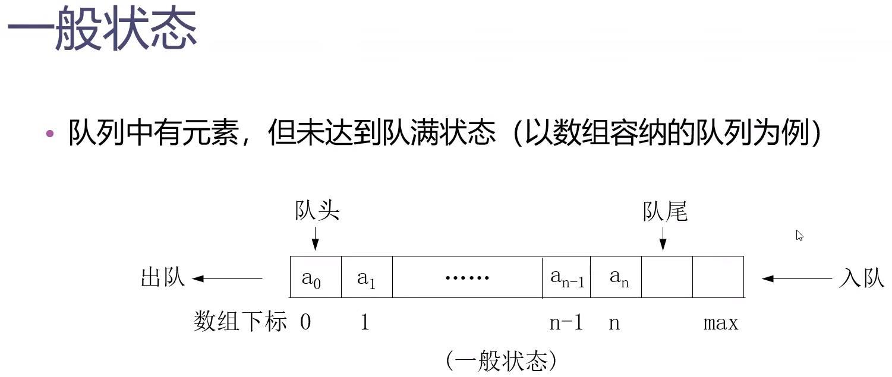

[TOC]
# 函数模板与类模板
## 函数模板
### 例：求绝对值函数的模板
问题：整数类型和浮点数类型求绝对值的算法，需要写两种1重载函数吗？
```C++
int abs(int x){
    return x < 0 ? -x: x;
}

double abs(double x){
    return x < 0 ? -x: x;
}
```
解决：函数模板
- 创建一个通用功能的函数；
- 支持多种不同形参；
- 简化重载函数的函数体设计。
```C++
template<typename T>
T abs(T x){
    return x < 0 ? -x: x;
}
```
例：求绝对值函数的模板
```c++
#include<iostream>
using namespace std;

template<typename T>
T abs(T x){
    return x < 0 ? -x: x;
}

int main(){
    int n = -5;
    double d = -5.5;
    cout << abs(n) << endl;
    cout << abs(d) << endl;
    return 0;
}
```
### 函数模板定义语法
- 语法形式：
  - `template<模板参数表>`
  - 函数定义
- 模板参数表的内容
  - 类型参数：`class`（或`typename`）标识符
  - 常量参数：类型说明符 标识符
  - 模板参数：`teemplate<参数表> class 标识符`
例：9_1函数模板示例
```c++
#include<iostream>
using namespace std;

template<class T> // 定义函数模板
void outputArray(const T *array, int count){
    for(int i = 0; i < count; i ++)
        cout << array[i] << " "; // 如果数组对象时类的对象，需要该对象所属类重载了流插入运算符"<<"
    cout << endl;
}

int main(){
    const int A_COUNT = 8, B_COUNT = 8, C_COUNT = 20;
    int a[A_COUNT] = {1, 2, 3, 4, 5, 6, 7, 8};
    double b[B_COUNT] = {1.1, 2.2, 3.3, 4.4, 5.5, 6.6, 7.7, 8.8};
    char c[C_COUNT] = "Welcom!";

    cout << " a array contains:" << endl;
    outputArray(a, A_COUNT);
    cout << "b array contains:" << endl;
    outputArray(b, B_COUNT);
    cout << "c array contains:" << endl;
    outputArray(c, C_COUNT);
    return 0;
}
```
### 注意：
- 一个函数模板并非自动可以处理所有类型的数据
- 只有能够进行函数模板中运算的类型，可以作为类型实参
- 自定义的类，需要重载模板中的运算符，才能作为类型实参

## 类模板
### 类模板的作用
- 使用类模板使用户可以为类声明一种模式，使得类中的某些数据成员。某些成员函数的参数、某些成员函数的返回值，能取任意类型（包括基本类型的和用户自定义类型）。
### 类模板的声明
- 类模板：
  > `template`<模板参数表>
  `class` 类名
  {类成员声明};
- 如果需要在类模板以外定义其成员函数，则要采用以下的形式：
  - `template<模板参数表>`
  - `类型名 类名<模板参数标识符列表>::函数名（参数表）`
- 模板参数表中参数可以声明为该模板类的友元类
- 可通过`typedef`或者`using`对实例化的类模板定义别名
### 模板的默认实参
类似于函数形参可有默认实参，函数/类模板可有默认模板实参：
```c++
template <typename T = double>
class Point{
    public:
        Point(T _x = 0, T _y = 0):x(_x), y(_y){}
    private:
        T x;
        T y;
};
```
使用模板：
```c++
Point<int> point(); // 给定模板参数int，定义整数点对象（0， 0）
Point<> point(); // 模板参数列表<>为空，默认double类型初始化
```
### 例9_2类模板示例
```c++
#include<iostream>
#include<cstdlib>
using namespace std;

struct Student{
    int id; // 学号
    float gpa; // 平均分
};

template<class T>
class Store{ // 类模板：实现对任意类型数据进行存取
    private:
        T item; // item用于存放任意类型的数据
        bool haveValue; // haveValue标记item是否已被存入内容
    public:
        friend T; // 将参数类型T声明为友元类
        Store();
        T & getElem(); // 提取数据函数
        void putElem(const T &x); // 存入数据函数
};

template <class T>
Store<T>::Store():haveValue(false){}
template <class T>
T &Store<T>::getElem(){
    // 如试图提取未初始化的数据，则终止程序
    if(!haveValue){
        cout << "No item present!" << endl;
        exit(1); // 使程序完全退出，返回操作系统。
    }
    return item; // 返回item中存放的数据
}
template <class T>
void Store<T>::putElem(const T&x){
    // 将haveValue置为true，表示item中已存入数值
    haveValue = true;
    item = x; // 将x值存入item
}

int main(){
    using IntStore = Store<int>;
    IntStore s1, s2;
    s1.putElem(3);
    s2.putElem(-7);
    cout << s1.getElem() << " " << s2.getElem() << endl;

    Student g = {1000, 23};
    Store<Student> s3;
    s3.putElem(g);
    cout << "The student id is " << s3.getElem().id << endl;

    Store<double> d;
    cout << "Retrieving object D ...";
    cout << d.getElem() << endl; // d未初始化，执行函数D.getElement()时导致程序终止
    return 0;
}
```
# 数组类模板
## 群体
### 群体的概念
- 群体是指由多个数据元素组成的集合体。群体可以分为两个大类：线性群体和非线性群体、
- 线性群体中的元素按位置排列有序，可以区分第一个元素、第二个元素等。
- 非线性群体不用位置顺序来标识元素。
### 线性群体
- 在线性群体中，又可按照访问元素的不同方法分为直接访问、顺序访问和索引访问。
- 在本章我们只介绍直接访问赫尔顺序访问。
#### 直接访问的线性群体——数组类
- 静态1数组是具有固定元素个数的群体，其中的元素可以通过下标直接访问。
  - 缺点：大小在编译时就已经确定，在运行时无法修改。
- 动态数组由一系列位置连续的，任意数量相同类型的元素组成。
  - 优点：其元素个数可在程序运行时改变。
- `vector`就是用类模板实现的动态数组。
例：9_3动态数组类模板程序
```c++
#ifndef ARRAY_H
#define ARRAY_H
#include<cassert>

template <class T> // 数组类模板定义
class Array{
    private:
        T* list; // 用于存放动态分配的数组内存首地址
        int size; // 数组大小（元素个数）
    public:
        Array(int sz = 50); // 构造函数
        Array(const Array<T> &a); // 复制构造函数
        ~Array(); // 析构函数
        Array<T> & operator = (const Array<T> &rhs); // 重载"="
        T & operator[](int i); // 重载"[]"
        const T & operator[] (int i) const; // 重载"[]"常函数
        operator T*(); // 重载到T*类型的转换
        operator T*(); // 重载到T*类型的转换
        operator const T * ();
        int getSize() const; // 取数组的大小
        void resize(int sz); // 修改数组的大小
};

template <class T> Array<T>:: Array(int sz){// 构造函数
    assert(sz >= 0); // sz为数组大小（元素个数），应当非负
    size = sz; // 将元素个数赋值给变量size
    list = new T[size]; // 动态分配size个T类型的元素空间
}
template<class T> Array<T>::~Array(){// 析构函数
    delete [] list;
}
```
##### 为什么有的函数返回引用
- 如果一个函数的返回值是一个对象的值，就是右值，不能成为左值。
- 如果返回值为引用。由于引用时对象的别名，通过引用可以改变对象的值，因此是左值。

# 链表类模板
## 顺序访问的线性群体——链表
- 链表是一种动态数据结构，可以用来表示顺序访问的线性群体。
- 链表是由系列结点组成的，结点可以在运行时动态生成。
- 每一个结点包括数据域和指向链表中下一个结点的指针（即下一个结点的地址）。如果链表每个结点中只有一个指向后继结点的指针，则该链表称为单链表。
## 单链表的结点类模板
```c++
template <class T>
class Node{
    private:
        Node<T> *next;
    public:
        T.data;
        Node(const T& item, Node<T>* next = 0);
        void insertAfter(Node<T> *p);
        Node<T> *deleteAfter();
        Node<T> *nextNode() const;
};
```


例：9_5结点类模板
```c++
//Node.h
#ifndef NODE_H
#define NODE_H
// 类模板的定义
template <class T>
class Node{
    private:
        Node<T> *next; // 指向后继结点的指针
    public:
        T data; // 数据域
        Node(const T &data, Node<T> *next = 0);// 构造函数
        void insertAfter(Node<T> *p);// 在本结点之后插入一个同类结点p
        Node<T> *deleteAfter(); // 删除本结点的后继结点，并返回其地址
        Node<T> *nextNode(); // 获取后继结点的地址
        const Node<T> *nextNode() const; // 获取后继结点的地址
};

// 类的实现部分
// 构造函数，初始化数据和指针成员
template <class T>
Node<T>::Node(const T& data, Node<T> *next = 0): data(data), next(next){}
// 返回后继结点的指针
template <class T>
Node<T> *Node<T>::nextNode() {
    return next;
}
// 返回后继结点的指针
template <class T>
const Node<T> *Node<T>::nextNode() const{
    return next;
}
// 在当前结点之后插入一个结点p
template <class T>
void Node<T>::insertAfter(Node<T> *p){
    p->next = next; // p结点指针域指向当前结点的后继结点
    next = p; // 当前结点的指针域指向p
}
// 删除当前结点的后继结点，并返回1其地址
templte <class T> Node<T> *Node<T>::deleteAfter(){
    Node<T> *tempPtr = next; // 将欲删除的结点地址存储到tmpPtr中
    if(next == 0) // 如果当前结点没有后继结点，则返回空指针
        return 0;
    next = tempPtr->next; // 使当前结点的指针域指向tempPtr的后继结点
    return tempPtr;
}
#endif // NODE_H
```
## 链表的基本操作
- 生成链表
- 插入结点
- 查找结点
- 删除结点
- 遍历链表
- 清空链表
```C++
#ifndef LINKEDLIDT_H
#define LINKEDLISH_H
#include "Node.h"
template <class T>
class LinkedList{
    private:
        Node<T> *front, *rear; // 表头和表尾
        Node<T> *prevPtr, *currPtr; // 记录表当前遍历位置的指针，由插入和删除操作更新
        int size; // 表中的元素个数
        int position; // 当前元素在表中的位置序号。由函数reset使用
        // 生成新结点，数据域为item，指针域为ptrNext
        Node<T> *newNode(const T &item, Node<T> *preNext = NULL);
        void freeNode(Node<T> *p); // 释放结点
        // 将链表L复制到当前表（假设当前表为空），被复制构造函数、operator = 调用
        void copy(const LinkedList<T> &L);
}
```

# 栈与队列类模板
## 栈

### 栈的应用举例——表达式处理

### 栈的基本状态
- 栈空
  
- 栈满
  
- 一般状态
  

### 栈的基本操作
- 初始化
- 入栈
- 出栈
- 清空栈
- 访问栈顶元素
- 检测栈的状态（满、空）
### 例9_8栈类模板
```c++
// Stack.h
#ifndef STACK_H
#define STACK_H
#include<cassert>
template <class T, int SIZE = 50>
class Stack{
    private:
        T list[SIZE];
        int top;
    public:
        Stack();
        void push(const T &item);
        T pop();
        const T &peek() const;
        bool isEmpty() const;
        bool isFull() const;
};
// 模板实现
template <class T, int SIZE>
Stack<T, SIZE>::Stack():top(-1){}
template<class T, int SIZE>
void Stack<T, SIZE>::push(const T &item){
    assert(!isFull());
    list[++top] = item;
}
template <class T, int SIZE>
T Stack<T, SIZE>::pop(){
    assert(!isEmpty());
    return list[top--];
}
template <class T, int SIZE>
const T &Stack<T, SIZE>::peek() const{
    assert(!isEmpty());
    return list[top]; // 返回栈顶元素
}
template <class T, int SIZE>
bool Stack<T, SIZE>::isEmpty() const{
    return top == -1;
}
template <class T, int SIZE>
bool Stack<T, SIZE>::isFull() const{
    return top == SIZE - 1;
}

template<class T, int SIZE>
void Stack<T, SIZE>::clear(){
    top = -1;
}

#endif//STACK_H
```
## 队列类
队列是只能向一端添加元素，从另一端删除元素的线性群体。

### 队列的基本状态
- 队空
  
- 队满
  
- 一般状态
  
### 循环队列
- 在想象中将数组弯曲成环形，元素出队时，后继元素不移动，每当队尾达到数组最后一个元素时，便再回到数组开头。
  
### 例9_10队列类模板
```c++
//Queue.h
#ifndef QUEUE_H
#define QUEUE_H
#include<cassert>
// 类模板的定义
template <class T, int SIZE = 50>
class Queue{
    private:
        int front, rear, count; // 队头指针、队尾
        T list[SIZE]; // 队列元素数组
    public:
        Queue(); // 构造函数，初始化头指针、队尾指针、元素个数
        void insert(const T &item); // 新元素入队
        T remove(); // 元素出队
        void clear(); // 清空队列
        const T &getFront() const; // 访问队首元素
        // 测试队列状态
        int getLength() const; // 求队列长度
        bool isEmpty() const; // 判断队列空否
        bool isFull() const; // 判断队列满否
};
// 构造函数，初始化队头指针、队尾指针、元素个数
template <class T, int SIZE>
void Queue<T,SIZE>::insert(const T& item){// 向队尾插入元素
    assert(count != SIZE);
    count ++; // 元素个数增1
    list[rear] = item; // 向队尾插入元素
    rear = (rear + 1) % SIZE; // 队尾指针增1，用取余运算实现循环队列
}
template <class T, int SIZE> T Queue<T, SIZE>::remove(){
    assert(count != 0);
    int temp = front; // 记录下原先的队首指针
    count --; // 元素个数自减
    front = (front + 1) % SIZE; // 队首指针增1.取余以实现循环队列
    return list[temp]; // 返回首元素值
}
template <class T, int SIZE>
int Queue<T, SIZE>
int Queue<T, SIZE>::getLength() const{// 返回队列元素个数
    return count;
}
template <class T, int SIZE>
bool Queue<T, SIZE>::isFull() const{ // 测试队满否
    return count == SIZE;
}
template<class T, int SIZE>
void Queue<T, SIZE>::clear(){// 清空队列
    count = 0;
    front = 0;
    rear = 0;
}
#endif //QUEUE_H
```

# 几个简单的排序查找算法
## 基本术语
- 数据元素：数据的基本单位。在计算机中通常作为一个整体进行考虑。一个数据元素可由若干数据项组成。
- 关键字：数据元素由某个数据项的值，用它可以标识（识别）一个数据元素。
- 在排序过程中需要完成两种基本操作：
  - 比较两个数的大小
  - 调整元素在序列中的位置
## 内部排序与外部排序
- 内部排序：待排序的数据元素存放在计算机内存中进行的排序过程。
- 外部排序：待排序的数据元素数量很大，以致内存中一次不能容纳全部数据，在排序过程中尚需对外存进行访问的排序过程。
## 几种简单的内部排序方法
### 插入排序
- 每一步将一个待排序元素按其关键字值的大小插入到已排序序列的适当位置上，直到待排序元素插入完为止。

例9_11直接插入排序函数模板
```c++
template <class T>
void insertionSort(T a[], int n){
    int i, j;
    T temp;

    for(int i = 1; i < n; i ++){
        int j = i;
        temp = a[i];
        while(j > 0 && temp < a[j - 1]){
            a[j] = a[j - 1];
            j --;
        }
        a[j] = temp;
    }
}
```
### 选择排序
- 每次从待排序序列中选择一个关键字最小的元素，（当需要按关键字升序排序时），顺序排在已排序序列的最后，直至全部排完。

```c++
template <class T>
void mySwap(T &x, T &y){
    T temp = x;
    x = y;
    y = temp;
}

template <class T>
void selectionSort(T a[], int n){
    for(int i = 0; i < n - 1; i ++){
        int leastIndex = i;
        for(int j = i + 1; j < n; j ++)
            if(a[j] < a[leastIndex])
                leastIndex = j;
        mySwap(a[i], a[leastIndex]);
    }
}
```
### 交换排序
- 两两比较待排序序列中的元素，并交换不满足顺序要求的各对元素，直到全部满足顺序要求为止。

- 对具有n个元素的序列按升序进行起泡排序的步骤：
  - 首项将第一个元素与第二个元素进行比较，若为逆序，则将两元素交换。然后比较第二、第三个元素，依次类推，直到第n-1和第n个元素进行了比较和交换，此过程称为第一趟起泡排序。经过第一趟，最大的元素便被交换到第n个位置。
  - 对前n-1个元素进行第二趟起泡排序，将其中最大元素交换到第n-1个位置。
  - 如此继续，直到某一趟排序未发生任何交换时，排序完毕。对n个元素的序列，起泡排序最多需要进行n-1趟。
```c++
template <class T>
void mySwap(T &x, T &y){
    T temp = x;
    x = y;
    y = temp;
}

template <class T>
void bubbleSort(T a[], int n){
    int i = n - 1;
    while(i > 0){
        int lastExchangeIndex = 0;
        for(int j = 0; j < i; j ++)
            if(a[j + 1] < a[j]){
                mySwap(a[j], a[j + 1]);
                lastExchangIndex = j;
            }
            i = lastExchangeIndex;
    }
}
```

## 查找
### 顺序查找
- 顺序查找的基本思想
  - 从序列的首元素开始，逐个元素与待查找的关键字进行比较，直到找到相等的。若整个序列中没有与待查找关键字相等的元素，就是查找不成功。
```c++
template <class T>
int seqSearch(const T list[], int n, const T &key){
    for(int i = 0; i < n; i ++)
        if(list[i] == key)
            return i;
    return -1;
}
```
### 折半查找（二分法查找）算法
对于已按关键字排序的序列，经过一次比较，可将序列分割成两部分，然后只在有可能包含待查元素的一部分中继续查找，并根据试探结果继续分割，逐步缩小查找范围，直至找到或找不到为止。


```c++
template <class T>
int binSearch(const T list[], int n, const T &key){
    int low = 0;
    int high = n - 1;
    while(low <= high){
        int mid = (low + high) / 2;
        if(key == list[mid])
            return mid;
        else if(key == list[mid])
            high = mid - 1;
        else
            low = mid + 1;
    }
    return  -1;
}
```

# 小结
- 主要内容
  - 模板、群体类和群体数据的组织
- 达到的目标
  - 掌握函数模板与类模板的语法和使用方法
  - 理解线性表结构
  - 掌握集中简单的查找与排序算法群体数据的组织