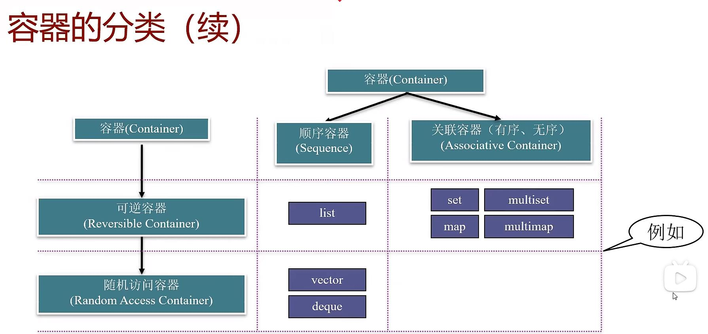

[TOC]

# 泛型程序设计及STL的结构
## 泛型程序设计的基本概念
编写不依赖于具体数据类型的程序
将算法从特定的数据结构中抽象出来，成为通用的`C++`的模板为泛型程序设计奠定了关键的基础
### 术语：概念
- 在`C++` `STL`库中用“概念”来界定具备一定功能的数据类型。例如：
  - 将“可以比大小的所有数据类型（有比较运算符）”这一概念记为`Comparable`
  - 将“具有公有的复制构造函数并可以用'='赋值的数据类型”这一概念记为`Assignable`
  - 将“可以比大小、具有公有的复制构造函数并可以用'='赋值的所有数据类型”这个概念记作`Sortable`。
- 对于两个不同的概念A和B，如果概念A所需求的所有功能也是概念B所需求的功能，那么就说概念B是概念A的子概念。例如：
  - `Sortable`既是`Comparable`的子概念，也是`Assignable`的子概念
- `ISO/IEC TS 19217:2015 Information technology -- Programming languages -- C++ Extension for concepts`
### 术语：模型
- 模型（`model`）：符合一个概念的数据类型称为该概念的模型，例如：
  - `int`型是`Comparable`概念的模型。
  - 静态数组类型不是`Assignable`概念的模型（无法用"="给整个静态数组赋值）
### 用概念做模板参数名
- 很多`STL`的实现代码就是使用概念来命名模板参数的。
- 为概念赋予一个名称，并使用该名称作为模板参数名。
- 例如：
  - 表示`insertionSort`这样一个函数模板的原型：
    ```c++
    template <class Sortable>
    void insertionSort(Sortable a[], int n);
    ```
## STL简介
标准模板库（`Standard Template Library`，简称`STL`）提供了一些非常常用的数据和算法
- 标准模板库（`Standard Template Library`，简称`STL`）定义了一套概念体系，为泛型程序设计提供了逻辑基础
- `STL`中的各个类模板、函数模板的参数都是用这个体系中的概念来规定的。
- 使用`STL`的模板时，类型参数既可以是`C++`标准库中已有的类型也可以是自定义的类型——只要这些类型是所要求概念的模型。
### STL的基本组件

#### 容器(`container`)
- 容纳、包含一组元素的对象。
- 基本容器类模板
  - 顺序容器
    - `array`（数组）、`vector`（向量）、`deque`（双端队列）、`forward_list`（单链表）、`list`（列表）
  - （有序）关联容器
    - `set`（集合）、`multiset`（多重集合）、`map`（映射）、`multimap`（多重映射）
  - 无序关联容器
    - `unordered_set`（无序集合）、`unordered_multiset`（无序多重集合）
    - `unordered_map`(无序映射）、`unorder_multimap`(无序多重映射）
- 容器适配器
  - `stack`（栈）、`queue`（队列）、`priority_queue`（优先队列）
- 使用容器，需要包含对应的头文件
#### 迭代器(`iterator`)
- 迭代器是泛化的指针
- 提供了顺序访问容器中每个元素的方法；
- 可以使用"++"运算符来获得指向下一个元素的迭代器；
- 可以使用"*"运算符访问一个迭代器所指向的元素，如果元素类型是类或结构体，还可以使用"->"运算符直接访问该元素的一个成员；
- 有些迭代器还支持通过"--"运算符获得指向上一个元素的迭代器；
- 迭代器是泛化的指针：指针也具有同样的特性，因此指针本身就是一种迭代器；
- 使用独立于`STL`容器的迭代器，需要包含头文件<`iterator`>
#### 函数对象(`function object`)
- 一个行为类似函数的对象，对它可以像调用函数一样调用。
- 函数对象是泛化的函数：任何普通的函数和任何重载了"()"运算符的类的对象都可以作为函数对象使用
- 使用`STL`的函数对象，需要包含头文件<`functional`>
#### 算法(`algorithms`)
- STL包括70多个算法
  - 例如：排序算法，消除算法，计数算法，比较算法，变换算法，置换算法和容器管理等
- 可以广泛用于不同的对象和内置的数据类型。
- 使用STL的算法，需要包含头文件<`algorithm`>。
### 算法举例——transform算法
- `transform`算法顺序遍历`first`和`last`两个迭代器所指向的元素；
- 将每个元素的值作为函数对象`op`的参数；
- 将`op`的返回值通过迭代器`result`顺序输出；
- 遍历完成后`result`迭代器指向的是输出的最后一个元素的下一个位置，`transform`会将迭代器返回
- 例如，以下可以是`transform`算法的一种实现：
  ```c++
  template <class InputIterator, class OutputIterator, class UnaryFunction>
  template <class InputIterator, class OutputIterator, class UnaryFunction>
  OutputIterator transform(InputIterator first, InputIterator last, result, UnaryFunction op){
    for(;first != last; ++ first, ++ result)
        *result = op(*first);
    return result;
  }
  ```
# 迭代器
- 迭代器是算法和容器的桥梁
  - 迭代器用作访问容器中的元素
  - 算法不直接操作容器中的数据，而是通过迭代器间接操作
- 算法和容器独立
  - 增加新的算法，无需影响容器的实现
  - 增加新的容器，原有的算法也能适用
## 输出流迭代器和输出流迭代器
- 输入流迭代器
  - `istream_iterator<T>`
  - 以输入流（如cin）为参数构造
  - 可用*(p++)获取下一个输入的元素
- 输出流迭代器
  - `ostream_iterator<T>`
  - 构造时需要提供输出流（如cout）
  - 可用(*p++) = x将x输出到输出流
- 二者都属于适配器
  - 适配器是用来为已有对象提供新的接口的对象
  - 输入流适配器和输出流适配器为流对象提供了迭代器的接口
## 迭代器的区间
- 两个迭代器表示一个区间：`[p1，p2)`
- STL算法常以迭代器的区间作为输入，传递输入数据
- 合法的区间
  - p1经过n次（n > 0)自增（++）操作`p1==p2`
- 区间包含p1，但不包含p2
## 迭代器的辅助函数
- `advance(p, n)`
  - 对p执行n次自增操作
- `distance(first, last)`
  - 计算两个迭代器`first`和`last`的距离，即对first执行多少次"++"操作后能够使得`first == last`
# 容器的基本功能与分类
容器类是容纳/包含一组元素或元素集合的对象。
基于容器中元素的组织方式：顺序容器、关联容器。
按照与容器所关联的迭代器类型划分：可逆容器->随机访问容器。
- 容器
  - 顺序容器
    - `array`（数组）、`vector`（向量）、`deque`（双端队列）、`forward_list`（单链表）、`list`（列表）
  - （有序）关联容器
    - `set`（集合）、`multiset`（多重集合）、`map`（映射）、`multimap`（多重映射）
  - 无序关联容器
    - `unordered_set`（无序集合）、`unordered_multiset`（无序多重集合）
    - `unordered_map`(无序映射）、`unorder_multimap`(无序多重映射）



## 容器的通用功能
- 容器的通用功能
  - 用默认构造函数构造空容器
  - 支持关系运算符：`==`、`！=`、`<`、`<=`、`>`、`>=`
  - `begin()`、`end()`：获得容器首、尾迭代器
  - `cbegin()`、`cend()`：后的容器首、尾常迭代器，不需要改变容器时更加安全
  - `clear()`：将容器清空
  - `empty()`：判断容器是否为空
  - `size()`：得到容器元素个数
  - `s1.swap(s2)`：将`s1`和`s2`两容器内容交换
- 相关数据类型
  - `S::iterator`:指向容器元素的迭代器类型
  - `S::const_iterator`:常迭代器类型
## 对可逆容器的访问
- STL为每个可逆容器都提供了逆向迭代器，逆向迭代器可以通过下面的成员函数得到：
  - `rbegin()`：指向容器尾的逆向迭代器
  - `rend()`：指向容器首的逆向迭代器
- 逆向迭代器的类型名的表示方式如下（S表示容器类型）：
  - `S::reverse_iterator`：逆向迭代器类型
  - `S::const_reverse_iterator`：逆向常迭代器类型
# 顺序容器
顺序容器的基本功能
顺序容器的特性
顺序容器的插入迭代器与适配器
- STL中的顺序容器
  - 向量(`vector`)
  - 双端队列(`deque`)
  - 列表(`list`)
  - 单向链表(`forward_list`)
  - 数组(`array`)
- 元素线性排列，可以随时在指定位置插入元素和删除元素。
- 必须符合`Assignable`这一概念（即具有公有的复制构造函数并可以用"="赋值）。
- `array`对象的大小固定，`forward_list`有特殊的添加和删除操作。
## 顺序容器的基本功能
不包括已在10.3节讲过的通用功能
不包括单向链表(`forward_list`，有特殊1的插入删除操作)和数组(`array`，大小固定)
### 构造函数
- 默认构造函数（已在10.3节介绍）
- `S s(n, t);` 构造一个由`n`个元素`t`构成的容器实例`s`
- `S s(n);` 构造一个有`n`个元素的容器实例`s`，每个元素都是`T()`
- `S s(q1, q2);` 使用将`[q1,q2)`区间内的数据作为`s`的元素构造`s`
### 赋值函数
`assign`将指定的元素赋给顺序容器，顺序容器中原先的元素会被清除，赋值函数的三种形式是与构造函数一一对应的：
- `s.assign(n)`赋值后的容器由`n`个`t`元素构成
- `s.assign(n)`赋值后的容器有`n`个元素的容器实例`s`，每个元素都是`T()`
- `s.assign(q1, q2)`赋值后的容器的元素为`[q1, q2)`区间内的数据
### 插入函数
可以一次插入一个或多个指定元素，也可以将一个迭代器区间中的序列插入，通过一个指向当前容器元素的迭代器来指示插入位置，返回值为指向新插入的元素中第一个元素的迭代器。
- `s.insert(p1, t)`在`s`容器中`p1`所指向的位置插入一个`t`的复制，插入后的元素夹在原`p1`和`p1 - 1`所指向的元素之间。
- `s.insert(p1, n, t)`在`s`容器中`p1`所指向的位置插入`n`个`t`的复制，插入后的元素夹在原`p1`和`p1 - 1`所指向的元素之间。
- `s.insert(p1, q1, q2)`将`[q1, q2)`区间内的元素顺序复制插入到`s`容器中`p1`位置处，新元素夹在原`p1`和`p1 - 1`所指向的元素之间
- `s.emplace(p1, args)`将参数`args`传递给`T`的构造新元素`t`，在s容器中`p1`所指向的位置插入该元素，插入后的元素夹在原`p1`和`p1 - 1`所指向的元素之间。
### 其他函数
- 删除函数
  - `erase`、`clear`、`pop_front`（只对`list`和`deque`），`pop_back`
- 首尾元素的直接访问
  - `front`、`back`
- 改变大小
  - `resize`
## 顺序容器的特性
向量、双端队列、列表、单向链表、数组
### 向量（vector）
- 特点
  - 一个可以扩展的动态数组
  - 随机访问、在尾部插入或删除元素块
  - 在中间或头部插入或删除元素慢
- 向量的容量
  - 容量（`capacity`）：实际分配空间的大小
  - `s.capacity`：返回当前容量
  - `s.reserve(n)`：若容量小于`n`，则对s进行扩展，使其容量至少为`n`
  - `s.shrink_to_fit`：回收未使用的元素空间，即`size`和`capacity`函数返回值相等
### 双端队列（deque）
- 特点：
  - 在两端插入或删除元素块
  - 在中间插入或删除元素慢
  - 随机访问较快，但比向量容量慢
### 列表（list）
- 特点
  - 在任意位置插入和删除元素都很快
  - 不支持随机访问
- 接合（`splice`）操作
  - `s1.splice(p, s2, q1, q2)`：将`s2`中`[q1, q2)`移动到`s1`中`p`所指向元素之前
### 单向链表（forwar_list）
- 单向链表每个结点只有指向下个结点的指针，没有简单的方法来获取一个结点的前驱；
- 未定义`insert`、`emplace`和`erase`操作，而定义了`insert_atter`、`emplace_after`和`erase_after`操作，其参数与`list`的`insert`、`emplace`和`erase`相同，但并不是插入或删除迭代器`p1`所指的元素，而是对`p1`所指元素之后的结点进行操作；
- 不支持`size`操作。
### 数组（array）
- `array`是对内置数组的封装，提供了更安全，更方便的使用数组的方式
- `array`的大小是固定的，定义时除了需要指定元素类型，还需要指定容器大小。
- 不能动态地改变容器大小
## 顺序容器的比较
- 当STL所提供的顺序容器各有所长也各有所短，我们在编写程序时应当根据我们对容器所需要执行的操作来决定选择哪一种容器。
  - 如果需要执行大量的随机访问操作，而且当扩展容器时只需要向容器尾部加入新的元素，就应当选择向量容器`vector`；
  - 如果需要少量的随机访问操作，需要在容器两端插入或删除元素，则应当选择双端队列容器`deque`；
  - 如果不需要对容器进行随机访问，但是需要在中间位置插入或删除元素，就应当选择列表容器`list`或`forward_list`；
  - 如果需要数组，`array`相对于内置数组类型而言，是一种更安全。更容易使用的数组类型。
## 顺序容器的插入迭代器与适配器
### 顺序容器的插入迭代器
- 用于向容器头部、尾部或中间指定位置插入元素的迭代器
- 包括前插迭代器（`front_inserter`）、后插迭代器（`back_inserter`)和任意位置插入迭代器（`inserter`）
- 例：
  ```c++
  list<int> s;
  back_inserter iter(s);
  *(iter++) = 5; // 通过iter把5插入s末尾
  ```
### 顺序容器的适配器
- 以顺序容器为基础构建一些常用数据结构，是对顺序容器的封装
  - 栈（stack）：最先压入的元素最后被弹出
  - 队列（queue）：最先压入的元素最先被弹出
  - 优先级队列（priority_queue)：最“大”的元素最先被弹出
#### 栈和队列模板
- 栈模板
  ```c++
  template <class T, class Sequence = deque<T> > class stack;
  ```
- 队列模板
  ```c++
  template <class T, class FrontInsertionSequence = deque<T> > class queue;
  ```
- 栈可以用任何一种顺序容器作为基础容器，而队列只允许用前插顺序容器（双端队列或列表）
#### 栈和队列共同支持的操作
- `s1 op s`2 `op`可以是`==`、`！=`、`<`、`<=`、`>`、`>=`之一，它会对两个容器适配器之间的元素按字典序进行比较
- `s.size()` 返回`s`的元素个数
- `s.empty()` 返回`s`是否为空
- `s.push(t)` 将元素`t`压入到`s`中
- `s.pop()` 将一个元素从`s`中弹出，对于栈来说，每次弹出的是最后被压入的元素，而对于队列，每次被弹出的是最先被压入的元素
- 不支持迭代器，因为它们不允许对任意元素进行访问
#### 栈和队列不同的操作
- 栈的操作
  - `s.top()`返回栈顶元素的引用
- 队列操作
  - `s.front()`获得队头元素的引用
  - `s.back()`获得队尾元素的引用
### 优先级队列
- 优先级队列也像栈与队列一样支持元素的压入和弹出，但元素弹出的顺序与元素大小有关，每次弹出的总是容器中最“大”的一个元素。
  - `template <class T, class Sequence = vector<T> > class priority_queue;`
- 优先级队列的基础容器必须是支持随机访问的顺序容器。
- 支持栈和队列的`size`、`empty`、`push`、`pop`几个成员函数，用法与栈和队列相同。
- 优先级队列并不支持比较操作。
- 与栈类似，优先级队列提供了一个`top`函数，可以获得下一个即将被弹出元素（即最“大”的元素）的引用。