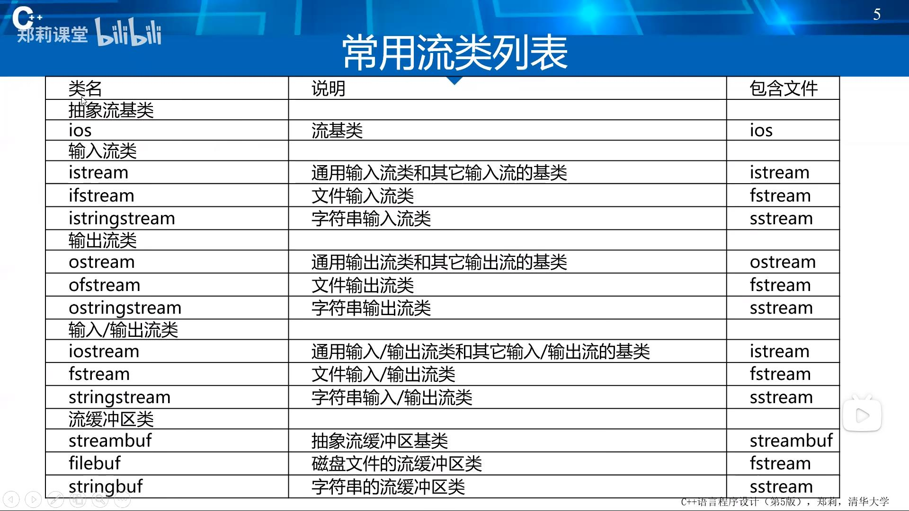
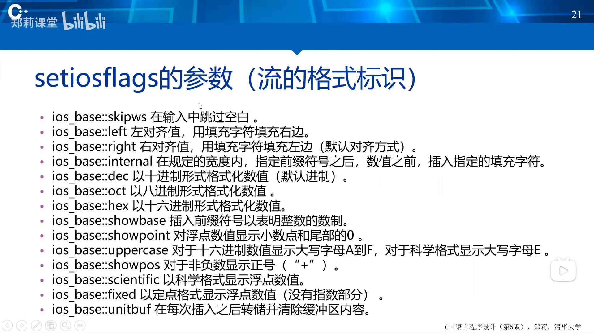

[TOC]

# 基本术语
## 流对象与文件操作
- 程序建立一个流对象
  - 当程序与外界环境进行信息交换时，存在着两个对象，一个是程序中的对象，另一个是文件对象。
  - 流是一种抽象，它负责在数据的生产者和数据的消费者之间建立联系，并管理数据的流动。
- 指定这个流对象与某个文件对象建立连接
- 程序操作流对象
- 流对象通过文件系统对所连接的文件对象产生作用。

## 提取与插入
- 读操作在流数据抽象中被称为（从流中）提取
- 写操作被称为（向流中）插入。



# 输出流
## 最重要的三个输出流
- `ostream`
- `ofstream`
- `ostringstream`

## 构造输出流对象
- `ofstream`类支持磁盘文件输出
- 如果在构造函数中指定一个文件名，当构造这个对象时该文件是自动打开的
  ```c++
  ofstream myFile("filename");
  ```
- 可以在调用默认构造函数之后使用`open`成员函数打开文件
  ```c++
  ofstream myFile; // 声明一个静态文件输出流对象
  myFile.open("filename"); // 打开文件，使流对象与文件建立联系
- 在构造对象或用`open`打开文件时可以指定模式
  ```c++
  ofstream myFile("filename", ios_base::out|ios_base::binary);
  ```

## 文件输出流成员函数的三种类型
- 与操纵符等价的成员函数。
- 执行非格式化写操作的成员函数。
- 其他修改流状态且不同于操纵符或插入运算符的成员函数。

## 文件输出流成员函数
- `open`函数
  - 把流与一个特定的磁盘文件关联起来。
  - 需要指定打开模式。
- `put`函数
  - 把一个字符写到输出流中。
- `write`函数
  - 把内存中的一块内容写到一个文件输出流中
- `seekp`和`tellp`函数
  - 操作文件流的内部指针
- `close`函数
  - 关闭与一个文件输出流关联的磁盘文件
- 错误处理函数
  - 在写到一个流时进行错误处理

## 向文本文件输出
标准输出设备显示器被系统看作文本文件，所以我们以向标准设备输出为例，介绍文本文件输出格式控制
### 插入运算符
- 插入(`<<`)运算符
  - 为所有标准C++数据类型预先设计的，用于传送字节到一个输出流对象。

### 操纵符(manipulator)
- 插入运算符与操纵符一起工作
  - 控制输出格式
- 很多操纵符都定义在
  - `ios_base`类中（如`hex()`）、`<iomanip>`头文件（如`setprecision()`）。
- 控制输出宽度
  - 在流中放入`setw`操纵符或调用`width`成员函数为每个项指定输出宽度。
- `setw`和`width`仅影响紧随其后的输出项，但其他流格式操纵符保持有效直到发生改变。
- `dec`、`oct`和`hex`操纵符设置输入和输出的默认进制。

### setiosflags操纵符
- 这个程序中，通过使用带参数的`setiosflags`操纵符来设置左对齐，`setiosflags`定义在头文件`iomanip`中。
- 参数`ios_base::left`是`ios_base`的静态常量，因此引用时必须包括`ios_base::`前缀。
- 这里需要用`resetiosflags`操纵符关闭左对齐标志。`setiosflags`不同于`width`和`setw`，它的影响是持久的，直到用`resetiosflags`操纵符重新恢复默认值为止。
- `setiosflags`的参数是该流的格式标志值，可用按位或(|)运算符进行组合


### 精度
- 浮点数输出精度的默认值是6，例如：`3466.98`。
- 要改变精度：`setprecision`操纵符（定义在头文件iomanip中）。
- 如果不指定`fixed`或`scientific`，精度值表示有效数字位数。
- 如果设置了`ios_base::fixed`或`ios_base::scientific`精度值表示小数点之后的位数。

## 向二进制文件输出
### 二进制文件流
- 使用`ofstream`构造函数中的模式参量指定二进制输出模式；
- 以通常方式构造一个流，然后使用`setmode`成员函数，在文件打开后改变模式；
- 通过二进制文件输出流对象完成输出

## 向字符串输出
将字符串作为输出流的目标，可以实现将其他数据类型转换为字符串的功能
### 字符串输出流(ostringstream)
- 用于构造字符串
- 功能
  - 支持`ofstream`类的除`open`、`close`外的所有操作
  - `str`函数可以返回当前已构造的字符串
- 典型应用
  - 将数值转换为字符串

# 输入流
- 重要的输入流类：
  - `istream`类最适合用于顺序文本模式输入。`cin`是其实例。
  - `ifstream`类支持磁盘文件输入
  - `istringstream`

## 构造输入流对象
- 如果在构造函数中指定一个文件名，在构造该对象时该文件便会自动打开。
  ```c++
  ifstream myFile("filename");
  ```
- 在调用默认构造函数之后使用`open`函数来打开文件。
  ```c++
  ifstream myFile; // 构造一个文件流对象
  myFile.open("filename"); // 打开文件"filename"
  ```
- 打开文件时可以指定模式
  ```c++
  ifstream myFile("filename", ios_base::in | ios_base::binary);
  ```

## 使用提取运算符从文本文件输入
- 提取运算符(`>>`)对于所有标准C++数据类型都是预先设计好的。
- 是从一个输入流对象获取字节最容易的方法。
- `ios`类中的很多操纵符都可以应用于输入流。但是只有少数几个对输入流对象具有实际影响，其中最重要的是进制操纵符`dec`、`oct`和`hex`。

## 输入流相关函数
- `open`函数把该流与一个特定磁盘文件相关联。
- `get`函数的功能与提取运算符（`>>`）很相像，主要的不同点是`get`函数在读入数据时包括空白字符。（第六章介绍过）
- `getline`的功能是从输入流中读取多个字符，并且允许指定输入终止字符，读取完成后，从读取的内容中删除终止字符。（第六章介绍过）
- `read`成员函数从一个文件读字节到一个指定的内存区域，由长度参数确定要读的字节数。当遇到文件结束或者在文本模式文件中遇到的文件结束标记符时结束读取。
- `seekg`函数用来设置文件输入流中读取数据的位置的指针。
- `tellg`函数返回当前文件读指针的位置。
- `close`函数关闭与一个文件输入流关联的磁盘文件。
  
## 输入流举例

## 从字符串输入
将字符串作为文本输入流的源，可以将字符串转换为其他数据类型
### 字符串输入流（istringstream）
- 用于从字符串读取数据
- 在构造函数中设置要读取的字符串
- 功能
  - 支持`iftream`类的除`open`、`close`外的所有操作
- 典型应用
  - 将字符串转换为数值
# 输入/输出流
## 两个重要的输入/输出流
- 一个`iostream`对象可以是数据的源或目的。
- 两个重要的`I/O`流类都是从`iostream`派生的，它们是`fstream`和`stringstream`。这些类继承了前面描述的`istream`和`ostream`类的功能。
  
## fstream类
- `fstream`类支持磁盘文件输入和输出。
- 如果需要在同一个程序中从一个特定磁盘文件读并写到该磁盘文件，可以构造一个`fstream`对象。
- 一个`fstream`对象是有两个逻辑子流的单个流，两个子流一个用于输入，另一个用于输出。

## stringstream类
- `stringstream`类支持面向字符串的输入和输出
- 可以用于对同一个字符串的内容交替读写，同样是由两个逻辑子流构成。

# 小结
- 主要内容
  - I/O流的概念、输出流、输入流、输入/输出流。
- 达到的目标
  - 理解I/O流的概念，学会I/O流类库实现文件输入/输出及格式控制。