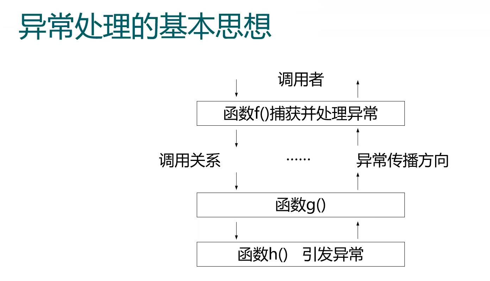
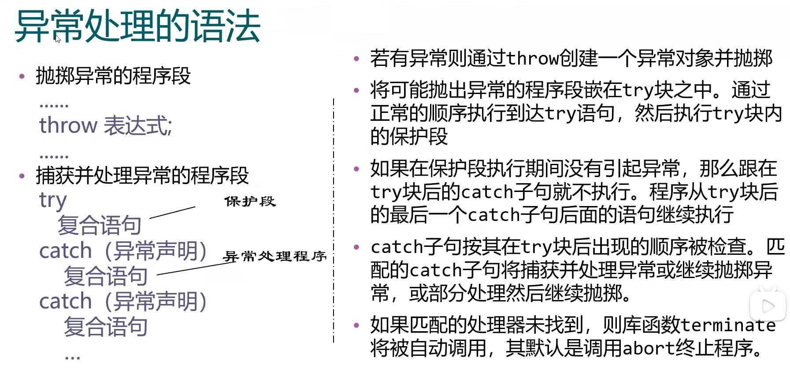
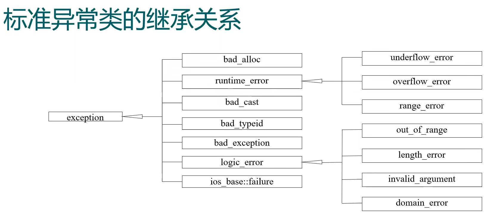
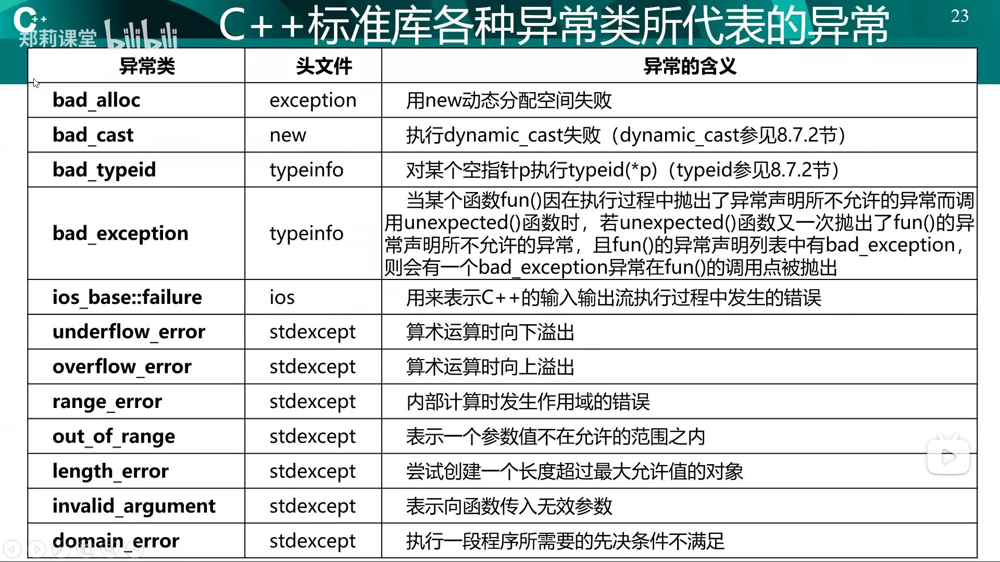
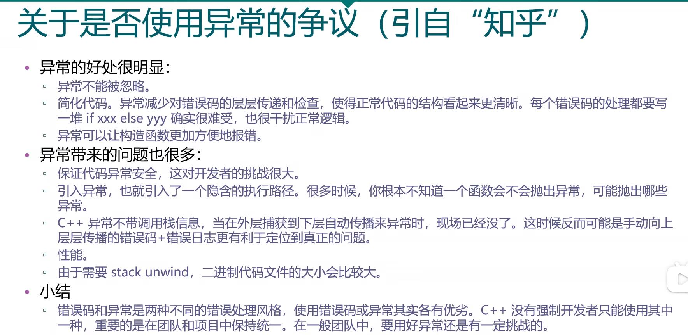

[TOC]

# 异常处理的基本思想
## 什么是异常和异常处理
- 异常就是程序在运行过程中出现问题
- “异常”问题并不经常出现
- 异常处理技术使我们可以写程序解决出现的异常问题
- 很多情况下，处理了异常就能使程序像没发生过问题一样继续执行
- 严重的问题也许使程序不能继续执行，使用异常处理可以用可控的方式对用户发生警示，然后再终止程序
- 本章将的异常1处理技术，使我们能够编写更健壮、更具容错性的程序，能处理发生的问题使程序继续执行，或者优雅地终止

## 应该如何处理异常的思考
- 是否应该频繁检测条件以决定程序接下来该如何执行？
- 请看下面这段伪代码：
  ```
  执行一项任务
  如果前序任务执行不正确
    执行错误处理
  执行下一项任务
  如果前序任务执行不正确
    执行错误处理
  ...
  ```
- 上面的伪代码中，每执行一项任务就要检测一下成功与否，不成功便立刻进行错误处理，成功则继续进行下一项任务
- 将程序逻辑与错误处理逻辑混在一起，使得程序的可读性、可修改性、可维护性差，难以调试，特别是大型程序
- 异常处理技术是我们可以将错误处理代码从主逻辑中移出，使程序更清晰，能增强程序的可维护性
- 我们可以有选择地处理异常：所有异常、某种特定类型的所有异常、一组相关类型的所有异常（例如属于某个类继承层次体系的异常）
- 这种灵活性，减小了错误被忽略的可能性，从而使程序更加健壮
- C++的异常处理机制使我们从项目一开始就很容易地设计异常处理

## 何时使用异常处理
- 异常处理用于处理同步错误，也就是语句执行时发生的错误
- 常见的适用异常处理的错误有：数组下标越界、算术溢出、被零除、函数参数不合法、内存不够引起的内存分配不成功
- 异常处理不是用于处理异常事件相关的错误的，例如：磁盘读写结束、网络信息到达、点击鼠标或键盘，这些用程序的控制流程并行、独立。
- 异常处理机制还适用于处理程序与其他软件元素，例如成员函数、构造函数、析构函数、类交互时出现的问题。
  - 这些软件元素通常并不在内部处理错误，而是使用异常提示程序发生了问题
  - 这就使得每个应用程序可以实现个性化的错误处理
- 复杂的应用程序通常由预定义的软件组件，和调用预定义组件的应用程序特有的软件组件组成
- 当预定义组件遇到异常问题时，需要一种机制将问题通知给调用者，预定义组件无法实现预见到不同的应用程序打算怎样处理异常问题





## 异常声明（异常规范，Exception specifications）
一个函数显示声明可能抛出的异常，有利于函数的调用者为异常处理做好准备
- 可以在函数的声明中列出这个函数可能抛掷的所有异常类型。
- 例如：
  ```c++
  void fun() throw(A, B, C, D);
  ```
- 若无异常接口声明，则此函数可以抛掷任何类型的异常。
- 不抛掷任何类型异常的函数声明如下：
  ```c++
  void fun() throw();
  或：void fun() noexcept;
  ```

## noexcept异常说明
- 对明确不会抛出异常的函数使用`noexcept`说明符修饰
- 声明方式：返回值类型`func（形参列表）noexcept;`
  - 异常处理使编译和运行时由额外开销，省去异常处理可优化加速调用
  - 需保持该函数内部调用函数和定义语句均不会抛出异常的一致性
- 配套有`noexcept`运算符，可判断函数是否使用了`noexcept`说明
例：
    ```c++
    void f() noexcept;
    noexcept(f()); // 返回true，因为f有noexcept说明
    ```

## 慎用异常声明的情况
- 对于带类型参数的函数模板，要尽量避免使用`exception specifications`，因为不同类型对于相同行为的定义不同，抛出的异常也就不同，因而函数模板很难或不可能确定它具现化的函数实体所抛出的异常
- 使用回调(`callback`)函数时
- 系统可能抛出的异常


# 异常处理中的构造与析构
## 自动的析构
- 找到一个匹配的`catch`异常处理后
  - 初始化异常参数
  - 将从对应的`try`块开始到异常被抛掷处之间构造（且尚未析构）的所有自动对象进行析构。
  - 从最后一个`catch`处理之后开始恢复执行。


# 标准程序库异常处理



## 标准异常类的基础
- `exception`：标准程序库异常类的公共基类
- `logic_error`表示可以在程序中被预先检测到的异常
  - 如果小心地编写程序，这类异常能够避免
- `runtime_erro`r`表示难以被预先检测的异常



# 小结
- 主要内容
  - 异常处理的基本思想、C++异常处理的实现、异常处理中的构造与析构
- 达到的目标
  - 简单了解C++的异常处理机制